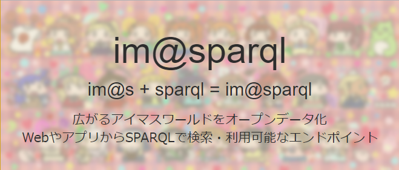

# im@sparql入門

<!--  -->

<!-- ここ囲いたい || 画像にしたい -->
<center><big><big><big>im@sparql</big></big></big></center>
<center><big><big>im@s + sparql = im@sparql</big></big></center>
<center>広がるアイマスワールドをオープンデータ化</center>
<center>WebやアプリからSPARQLで検索・利用可能なエンドポイント</center>

<!-- <big><big>4.1 はじめに</big></big>　　　im@sparqlとは   -->
## はじめに
　今年(2018年)でアイドルマスターシリーズは13周年を迎えました。765ASはMRステージという新しい表現方法を獲得し、シンデレラガールズは第7回総選挙で3名のボイスの実装が決まり、ミリオンライブは新規加入の2人が歌声を周年ライブで初めて披露し、SideMは2つ目のアニメである理由Miniが放映されました。さらに4月には新しいタイトルであるシャイニーカラーズが公開されました。アイドルマスターは留まることを知らず、その世界を拡大し続けています。私たちプロデューサーは各々の可能な範囲で、そのスピードに振り落とされないようにプロデュース活動をしていると思います。im@sparqlでは、その広がるアイマスワールドをデータベースという形でプロデュースの援助をします。つまり、どのようなアイドルがどのようなプロフィールなのか、どのユニットに所属しているのか、着用可能な衣装は何かなどの情報が集められ、資源化されています。  
　im@sparqlはLinked Open Data(LOD)の形を取っています。そのため誰でもデータベースへアクセスすることができます。しかし、そのままでは使えません。「SPARQL」というSQLに似たクエリ言語を通じてアクセスする必要があります。SPARQLについては以下をご覧ください。  
<!-- ここ賛否両論 -->
<!-- っていうかURLどうしようかしら -->
・SPARQL 1.1 Query Language(\*1)  
・SPARQL 1.1クエリ言語(\*2)  

<!-- <big><big>4.2 クエリを打ってみる</big></big>　　　はじめてのSPARQL   -->
## クエリを打ってみる
　本章では簡単なクエリを通じて、SPARQLの構文の基礎を学びます。結果の確認は、im@sparqlのサイト(\*3)を使うと簡単です。まずはこちらのクエリです。
```sparql
PREFIX schema: <http://schema.org/>
PREFIX imas: <https://sparql.crssnky.xyz/imasrdf/URIs/imas-schema.ttl#>
PREFIX imasrdf: <https://sparql.crssnky.xyz/imasrdf/RDFs/detail/>
SELECT * 
WHERE {
   imasrdf:Shimamura_Uzuki  schema:name         ?名前;
                            schema:birthDate    ?誕生日;
                            imas:nameKana       ?ひらがな名前.
}
```
このクエリは、本書の表紙のアイドルである島村卯月を主語とするインスタンスの述語と目的語を取得するものです。そうです、SPARQLは**主語**・**述語**・**目的語**の3つの関係でデータを表現しているのです。これを**トリプル**(Triple)と呼びます。実際にどう表示されるのか例を見てみましょう。以下は得られる結果をわかりやすくしたものです。

|主語|述語|目的語|
|:-:|:-:|:-:|
|島村卯月|名前|"島村卯月"|
|島村卯月|誕生日|04月24日|
|島村卯月|ひらがな名前|"しまむらうづき"|
これらのトリプルの関係を日本語で分かりやすくすると、
- 島村卯月の / 名前は / "島村卯月"である
- 島村卯月の / 誕生日は / 04月24日である
- 島村卯月の / ひらがな名前は / "しまむらうづき"である

という文で表せられます。  
クエリの説明をします。最初の3行ですが、Prefix(接頭辞)を宣言しています。主語や述語は必ずURIでなければならないのですが、冗長になってしまうので頻出する部分をこのように短く宣言して負担を減らすことができます。`typedef`や`#define`みたいなものでしょうか。つまり`imasrdf:Shimamura_Uzuki`は本来、`https://sparql.crssnky.xyz/imasrdf/RDFs/detail/Shimamura_Uzuki`ということです。  
　4行目以降のSQLに似ている部分が実際のクエリになります。同じように`SELECT`で表示したいモノを選び、`WHERE`でその条件を記述します。
```
"主語" "述語" "目的語".
"主語" "述語" "目的語".
```
と書くことでトリプルの条件を記述できますが、例のクエリのように
```
"主語"  "述語"  "目的語";
        "述語"  "目的語".
```
と、`;`で文を繋げることで同じ主語を継続して指定できます。取得対象の指定は、取得したい部分を`?`から始まる単語で変数とします。ワイルドカードのようなものです。主語述語目的語どこにでも配置でき、例のように英数字以外の文字も使えます。一方、固定したいものはURIなどの形で表現します。今回の場合、各目的語に対して当てはまるものは一つしか無いので、各変数は一つの答えのみを持ちます。当てはまるものが複数ある場合は、全ての組み合わせ(nCr)を配列にして返します。  
　最初に記したとおり、主語と述語にはほぼ必ず**URI(Uniform Resource Identifier)**が使用されます。`imasrdf:Shimamura_Uzuki`や`http://schema.org/name`です。Identifierという通り、なにかを区別して表現するものです。`imasrdf:Shimamura_Uzuki`はim@sparqlで島村卯月のインスタンスを表し、`http://schema.org/name`はschema.org(\*4)で名称を表す述語となっています。

<!-- <big><big>4.3 クエリをつなげてみる</big></big>　　　SPARQLの醍醐味   -->
## クエリをつなげてみる
4.2章では目的語を取得するクエリを例に取りましたが、目的語を固定して主語や述語を取得するクエリを作ることもできます。例えば...
```SPARQL
SELECT * 
WHERE {
   ?主語    ?述語   "島村卯月"@ja.
}
```
というクエリなんてどうでしょうか。URIが含まれていないのでもちろんPrefixは必要ないです。後ろに付いている`@ja`はそのオブジェクトの言語を示します。どういうことか、im@sparqlが動いているApache Jena Fuseki2(\*5)では、文字列型と言語が指定されたものは区別されるようです。そのため、(よくある)文字列を示す`"`だけでなく、日本語の文字列だと示すものを`@`付きで指定してあげる必要があります。ちなみに、なぜ`島村卯月`が普通の文字列ではなく日本語としているのかというと、今後他の言語で示されるかもしれないからです。(InitialiMess@geもやりましたし北米へは何度も出演してますからね！)  
　このクエリが取得するのは目的語が`"島村卯月"@ja`のものです。残念ながらim@sparqlには１つ目のクエリで固定した、島村卯月のインスタンスにあるschema:name(名称)にしかありません。結果は一つです。しかしこれは好都合です。取得したこの主語を使ってさらに別の情報を取得しましょう。  
```SPARQL
SELECT * 
WHERE {
   ?主語    ?述語   "島村卯月"@ja.
   ?主語2   ?述語2  ?主語.
}
```
なんだかややこしくなってきたかもしれませんね。クエリの中には2つの文があります。上の文は先程と一緒で、島村卯月のインスタンスのURIを取得するもの。そして下の文はその主語を目的語にし、別の主語と目的語を取得するものになります。つまり、島村卯月のインスタンスを目的語とする主語と述語の組み合わせを取得します。ヒット数が多いので全容は省略しますが、それは第5回総選挙の結果であったり、呼称に関するものだったり、ユニットであったり、衣装であったり...  

<!-- <big><big>4.4 クエリの結果を使ってみる</big></big>　データベースの存在意義   -->
## クエリの結果を使ってみる
　4.2章でオススメした、im@sparqlのサイトを利用したクエリのお試しですが、実際にはGetメソッドでクエリを飛ばしているのがURLから察せれると思います。SPARQLはエンドポイントをURLで設定しており、そこにGetやPostでクエリを送ることで結果を取得できます。im@sparqlの場合は`https://sparql.crssnky.xyz/spql/imas/query`です。以降にクエリを打ち込みます。ちなみに、`output=`パラメータを使えば`json`だけでなく`xml`、`csv`などの形式で取得できます。お好みでどうぞ！(この辺はFuseki2の公式サイトに解説が無いので、GitHubを参照するか試すしか無いでしょう)  
　今回はJSONで説明します。受け取ったものはまず、ヘッダ部"head"と結果部"results"に分かれています。ヘッダ部は表示する変数名を配列で持ちます。結果部でJSON配列からJSONオブジェクトを取得するときにKeyが分からなくても、ここを参照すれば良いです。結果部は文字通り結果を配列で持ちます。各結果の中にはその変数の属性や中身そのものが入っています。これは主語を島村卯月に固定して、述語と目的語を取得したときの一部の画像です。  
  
　あとはこの結果を用いてみなさんが煮るなり焼くなりするだけです。自分でデータを集めることなく簡単に欲しい情報が取得できてしまうので、アイマスワールドのデータを使った何かが簡単に実現できると思います。  

<!-- <big><big>4.5  おわりに</big></big>　　　For im@sparql   -->
## おわりに
　クエリを打ち、そこからプログラムが利用できる形で情報を取得できたので、これであなたもim@sparql経験者です。いわゆる`HelloWorld!`より何歩も進んだ存在でしょう。  
　im@sparqlはアイマスワールドをデータ資源へと写像した存在です。豊富なデータが、あなたのアイマスエンジニアリング力だけでなく、SPARQLという言語の習得の手助けとなるでしょう。しかし、このデータベースは完全ではありません。途中まで揃えてあるデータや、これから新しくアイマスワールドに加えらた情報を追加しなければなりません。im@sparqlの基になっているRDFファイルがGitHub上(\*6)で管理されています。みなさんのお力添えをお願いします。なにもPullReqを飛ばせとは言いません。issueにてマサカリを飛ばしていただくだけで結構です。まずはご自分の担当アイドル周りからでも、情報をデータベースへ登録してみませんか？

<footer>\*1：https://www.w3.org/TR/2013/REC-sparql11-query-20130321/</footer>
<footer>\*2：http://www.asahi-net.or.jp/~ax2s-kmtn/internet/rdf/REC-sparql11-query-20130321.html</footer>
<footer>\*3：https://sparql.crssnky.xyz/imas/</footer>
<footer>\*4：http://schema.org/ ：well knowな語彙一覧サイト</footer>
<footer>\*5：https://jena.apache.org/documentation/fuseki2/</footer>
<footer>\*6：https://github.com/imas/imasparql/</footer>