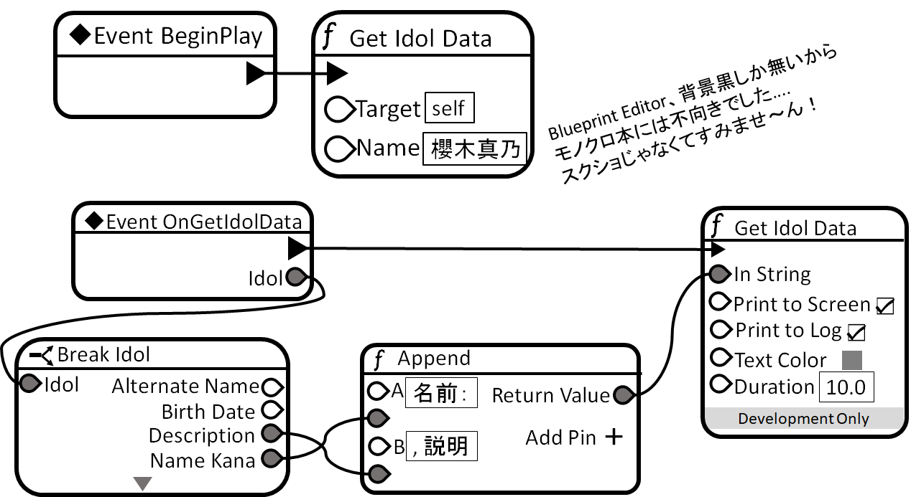

# im@sparql応用 〜UE4編〜
<p class="right">著:croMisa</p>

<!-- 定番にしていけ☆ -->
<center><big><big><big>im@sparql</big></big></big></center>
<center><big><big>im@s + sparql = im@sparql</big></big></center>
<center>広がるアイマスワールドをオープンデータ化</center>
<center>WebやアプリからSPARQLで検索・利用可能なエンドポイント</center>

## はじめに
　im@sparqlは、現在も広がるアイマスワールドをデータベースという形で皆様のプロデュースの援助をしています。つまり、どのようなアイドルがどのようなプロフィールなのか、どのユニットに所属しているのか、着用した衣装は何か、などの情報が集められ、資源化されています。そして、それらはLinked Open Data(LOD)の形を取っています。そのため誰でもデータベースへアクセスすることができます。しかし、そのままでは使えません。「SPARQL」というクエリ言語を通じてアクセスする必要があります。  

　先週号では、im@sparqlとは何か、SPARQLでどうアクセスするのかの入門部分をお届けしました。もし、先週号が近くにない場合は、im&#64;sparql.doc(\*1)をご参照ください。  

　今回は、実際にクエリを用いて何かを表現していこうと思います。そして、表現のキャンバスとして利用するのはUnreal Engine 4(\*2)です。UE4は、無償利用が可能(製品を販売して利益が出ればロイヤリティを払う)かつ、オープンソースの大きなC++ソフトウェアであり、C++の教材として利用することも推奨しています。そんなUE4に、im@sparqlを手軽に扱えるクラスの定義を通じて、im@sparqlの利用の一例を紹介していきます。なお、本項で説明するコードは**GitHubで公開(\*3)**しているのでご参照ください。
<footer>\*1：https://doc.crssnky.xyz/imasparql/</footer>
<footer>\*2：https://unrealengine.com</footer>
<footer>\*3：https://github.com/crssnky/BP_imasparql_UE4</footer>
  
  
  
<!--  ここで改ページしたい -->

## 環境準備
　まずは開発環境を整えます。と、言ってもUE4を導入するだけですが。GitHubのprivateなリポジトリなので、公式のちょっとした手順(\*4)が必要なことに注意してください。  

　開発環境が整ったら、まずはUE4でC++を扱う方法をサラッと把握しましょう。「プログラマ向けクイックスタート」(\*5)を参照すると良いと思います。  

　プロジェクトやクラスの作り方を把握したところで、次に必要なライブラリを導入します。im@sparqlはデフォルトで、JSONでクエリ結果を返します。ですのでUE4、もといC++でJSONが手軽に扱えるようライブラリを2つ導入します。
- cereal(https://github.com/USCiLab/cereal)
- cereal-UE4(https://github.com/usagi/cereal-UE4)

　導入は、cereal-UE4のREADME.mdまたは、cereal-UE4作成者の伊藤兎さんのブログ(\*6)を参照ください。  
　・・・  
<center>それではみなさん、ごじゅんび～？(\*7)</center>
<footer>\*4：https://www.unrealengine.com/ja/ue4-on-github</footer>
<footer>\*5：https://usagi.hatenablog.jp/entry/2018/03/30/043613</footer>
<footer>\*6：https://docs.unrealengine.com/en-US/Programming/QuickStart</footer>
<footer>\*7：315プロNight! F-LAGS担当期の「お助けラブリー・キューピッズ」コーナーの迷台詞</footer>

## 結果を受け取る構造体を定義する
　cerealでは、JSONの受け皿に構造体を使います。構造体を定義していきましょう。  

　まずはファイルの作成です。以下の場所に任意の名前でヘッダーファイルを作成してください。
```
<MyProjectDirectory>
|-Source
|  |-<MyProjectName>
|  | |-<<<任意の名前>>>.h
|  |-<MyProjectName>.Target.cs
|  |...
|-<MyProjectName>.uproject
|...
```

　実は`<MyProjectDirectory>/Source/<MyProjectName>`の下であれば好きにディレクトリを分けても良いので、お好みに合わせて整理しておいても大丈夫です。  

　ファイルを作成したら、このディレクトリ状態を教えてあげないといけません。`<MyProjectDirectory>`にある、`<MyProjectName>.uproject`を右クリックして`Generate <任意のIDE> project files`を実行して、更新しましょう。  
  <br/>

　ようやくコードが書ける状態になりました。お好きなエディタでヘッダーファイルを開いてください。最初は必要なヘッダーを定義していきます。
```C++
#pragma once

#include "CoreMinimal.h"
#include "Math/TransformCalculus2D.h"  // For"cereal-UE4.hxx"

#include "cereal/cereal.hpp"
#include "cereal/archives/json.hpp"
#include "cereal-UE4.hxx"
#include <sstream>

#include "<このヘッダーファイルの名前>.generated.h"
```

　UE4は`#progma once`で統一されています。倣いましょう。 `"CoreMinimal.h"`は、UE4でよく使われるものをまとめあげたものです(must最初)。`"Math/TransformCalculus2D.h"`は、後の`cereal-UE4.hxx`で参照される構造体`FMatrix2x2`が未定義になってしまうために、インクルードします(作成当時には`"CoreMinimal.h"`にあった?)。`cereal*`は、JSONを扱えるようにするcerealのために、`<sstream>`はcerealで変換に使うために必要です。最後に、`"<このヘッダーファイルの名前>.generated.h"`をインクルードします(must最後)。名前の通り、ビルド時に自動生成されるファイルです。  

　次に構造体を定義します。今回リクエストするクエリは以下の形なので、それを受け取れるものにします。  
```SPARQL
select distinct ?predicate ?object
where{
  ?idol_iri ?predicate ?object;
  <http://schema.org/name> "任意のアイドル名"@ja.
}
```

　つまり...(例：表紙アイドルの櫻木真乃)  
```JSON
{
  "head": {
    "vars": [ "predicate" , "object" ]
  } ,
  "results": {
    "bindings": [
      {
        "predicate":{ "type": "uri" , "value": "http://schema.org/name"} ,
        "object":{ "type": "literal" , "xml:lang": "ja" , "value": "櫻木真乃"}
      } ,
      {
        "predicate":{ "type": "uri" , "value": "http://schema.org/height"} ,
        "object":{ "type": "literal" , "datatype": "http://www.w3.org/2001/
XMLSchema#float" , "value": "155.0"}
      }
      //以下略
    ]
  }
}
```
です。この構造上、入れ子一つに対して構造体を定義する必要があります。まずは、`"predicate"`や`"object"`を格納する構造体を定義します。
```C++
USTRUCT(BlueprintType)
struct FimasparqlResultItem{
  GENERATED_BODY()
  UPROPERTY(BlueprintReadWrite, Category = "imasparql")
    FString type;
  UPROPERTY(BlueprintReadWrite, Category = "imasparql")
    FString datatype;
  UPROPERTY(BlueprintReadWrite, Category = "imasparql")
    FString xml_lang;
  UPROPERTY(BlueprintReadWrite, Category = "imasparql")
    FString value;
};
```

　UE4のコーディング規約(\*8)では、構造体名はF始まりになります。Fから始めましょう。
<footer>\*8：http://api.unrealengine.com/JPN/Programming/Development/CodingStandard/</footer>  

　マクロを読み飛ばしましたね。`USTRUCT()`はUE4に、構造体であることを示します。その中に`BlueprintType`を記述することで、Blueprint(\*9)でも扱える構造体になります。3行目にある`GENERATED_BODY()`は、UE4の機能で扱われるための**おまじない**です。`UPROPERTY()`は、すぐ下に書かれたプロパティがUE4がどのように扱うかを制御するためのマクロです。`BlueprintReadWrite`は名の通り、Blueprintで読み書きができるようにします。`Category`は、そのプロパティがどのカテゴリに属するかを決められます。  

　これでUE4内部でも認識される構造体ができました。ここにcerealがJSONから変換した結果を格納できるよう、関数を記述しましょう。  
```C++
template<class A, class T>
static void OptionalField(A &a, const std::string &name, T &t){
  try{
    a(cereal::make_nvp(name, t));
  } catch(std::exception &e){
    (void)e;
  }
}

template<typename T>
void serialize(T& a, FimasparqlResultItem& in){
  OptionalField(a, "datatype", in.datatype);
  OptionalField(a, "xml:lang", in.xml_lang);
  a(cereal::make_nvp("type", in.type));
  a(cereal::make_nvp("value", in.value));
}
```

　下部の関数は、cerealでJSONのオブジェクト名と構造体の変数名を対応付ける関数です。実はこの関数、optionalな要素に対応していません。cerealのissueで提案(\*10)されているみたいですが議論中です。その議論の中で提案されてた現時点での妥協案が上部の関数です。無ければ無いで、例外を吸収すれば良いみたいです(参考(\*11))。示したクエリ結果の例で、`datatype`と`xml:lang`がoptionalな要素だとわかるので、この2つを上部の関数で対応付けます。  
<footer>\*9 UE4のビジュアルプログラミングツール</footer>
<footer>\*10：https://github.com/USCiLab/cereal/issues/30</footer>
<footer>\*11：https://qiita.com/syoyo/items/b4f4add5aeacad0ddd6a</footer>

　次に、`"predicate"`や`"object"`の組み合わせ要素を持つ`"bindings"`です。先ほどと同じように構造体、対応付け関数の定義をします。
```C++
USTRUCT(BlueprintType)
struct FimasparqlBindings{
  GENERATED_BODY()
  UPROPERTY(BlueprintReadWrite, Category = "imasparql")
    FimasparqlResultItem predicate;
  UPROPERTY(BlueprintReadWrite, Category = "imasparql")
    FimasparqlResultItem object;
};
template<typename T>
void serialize(T& a, FimasparqlBindings& in){
  a(cereal::make_nvp("predicate", in.predicate));
  a(cereal::make_nvp("object", in.object));
}
```
　次に、`"bindings"`を配列で持つ`"result"`です。配列は、UE4の`TArray`(\*12)を用いて表現します。`std::vector`に似た可変長配列です。
```C++
USTRUCT(BlueprintType)
struct FimasparqlResult{
  GENERATED_BODY()
  UPROPERTY(BlueprintReadWrite, Category = "imasparql")
    TArray<FimasparqlBindings> bindings;
};
template<typename T>
void serialize(T& a, FimasparqlResult& in){
  a(cereal::make_nvp("bindings", in.bindings));
}
```

　最後に、`"result"`と同じ階層にある`"head"`を定義します。
```C++
USTRUCT(BlueprintType)
struct FimasparqlHead{
  GENERATED_BODY()
  UPROPERTY(BlueprintReadWrite, Category = "imasparql")
    TArray<FString> vars;
};
template<typename T>
void serialize(T& a, FimasparqlHead& in){
  a(cereal::make_nvp("vars", in.vars));
}
```
<footer>\*12：http://api.unrealengine.com/JPN/Programming/UnrealArchitecture/TArrays/</footer>

　これでJSONからcrealで構造体に変換する準備はできました。しかし、この構造体では汎化しすぎて使いづらいです。もう一つ使いやすい構造体を作りましょう。
- FIdol.h  
  (https://gist.github.com/crssnky/407eb222fd70ab8c788beeff6927b6b8)  
  短縮URL(https://bit.ly/2XAqaw9)

　im@sparqlに登録されているアイドルの持つ述語を変数に持つ`FIdol構造体`を定義し、`FimasparqlResult構造体`から良い感じに代入できるoperator=演算子などを定義してたら200行以上に膨れ上がってしまったので、リンクで失礼します。ここではoperator=演算子について説明します。と言っても特別なことはしていません。まず、クエリ結果がアイドルの情報を示す結果かを調べます。そして、述語ごとに対応する変数に代入しています。ここ完全に田植え作業なので、頭の良いC++erならばもっと効率の良い方法を知っていそうですね。  

　お疲れ様です！以上で、クエリ結果を受け取る準備ができました！次はクエリを送信するクラスを作っていきます。

## 送受信するクラスを定義する
　Blueprintのイベントとして利用するため、UE4のアクターとして定義します。アクターを新しく定義する場合は、UE4エディタから行いましょう(「プログラマ向けクイックスタート」の2項)。本項では、3項から割り込む形で説明します。  

### ヘッダ
　今回必要なヘッダはこちらです。
```C++
#include "CoreMinimal.h"
#include "GameFramework/Actor.h"
#include "Http.h"
#include "HttpManager.h"
#include "imasparqlJsonStructs.h"
#include "<このヘッダーファイルの名前>.generated.h"
```

　1,5,6番目はもう大丈夫ですね。2番目の`"GameFramework/Actor.h"`はアクターの基ですね、最初から書かれています。3,4番目は名前の通り、HTTP通信に必要なヘッダです。  

　あ、ちなみにC++でよく見られる、ヘッダではクラスの宣言だけを書いておき、ソースの方で本体をインクルードする方法ですが、UE4のマクロを含むものでやろうとするとビルドしてくれないので、素直にヘッダに書きましょう。  

　続いてクラス本体です。
```C++
UCLASS(Blueprintable, BlueprintType)
class <プロジェクト名>_API A<名付けた名前>: public AActor{
  GENERATED_BODY()
public:
  UFUNCTION(BlueprintCallable, Category = "imasparql")
    void GetIdolData(FString name);
  UFUNCTION(BlueprintImplementableEvent, BlueprintCallable,
            Category = "imasparql")
    void OnGetIdolData(const FIdol& idol);
private:
  void OnCompleteGetIdolData(FHttpRequestPtr req, FHttpResponsePtr res,
                              bool bSuccess);
};

```

　今回はクラスなので、`UCLASS()`マクロを使います。`Blueprintable`は、UE4のBlueprintでクラスを継承することを示します。一方`BlueprintType`は、Blueprintで他のクラスの変数にできることを示します。`class`句の後ろにある`<モジュール名>_API`は、このクラスが他のモジュールから利用できるようにするマクロです。おそらく最初から書かれています。`GENERATED_BODY()`も大丈夫ですね。`UFUNCTION()`は`UPROPERTY()`同様、UE4の機能から参照されるために書きます、それの関数版です。`BlueprintCallable`はBlueprintから呼び出し可能な関数であること、`BlueprintImplementableEvent`はBlueprintで実装可能なイベント関数であることを示します。これがあると、ソースで実装を書く必要がありません(コンパイルが通る)。  
　これらの関数を扱うイメージとしては、
1. `GetIdolData()`でim@sparqlにクエリを送信する。
2. レスポンスを受信したら、`OnCompleteGetIdolData()`が呼ばれる。
3. `OnCompleteGetIdolData()`で結果を`FIdol構造体`に変換して、`OnGetIdolData()`を呼ぶ。
4. Bllueprintで実装された`OnGetIdolData()`がなにかする。

です。それでは、関数を定義していきましょう。

### ソース
ヘッダは作成時に書かれた一つのみで追加の必要はありません。最初は`GetIdolData()`です。
```C++
void AimasparqlBP::GetIdolData(FString name){
  auto& http = FHttpModule::Get();
  TSharedRef<IHttpRequest> request = http.CreateRequest();
  request->SetURL("https://sparql.crssnky.xyz/spql/imas/query?\
force-accept=text%2Fplain&query=select%20distinct%20%3fpredicate\
%20%3fobject%0d%0awhere%7b%0d%0a%20%20%3fidol_iri%20%3fpredicate\
%20%3fobject%3b%0d%0a%20%20%3chttp%3a%2f%2fschema%2eorg%2fname\
%3e%20%22" + FGenericPlatformHttp::UrlEncode(name) + "%22%40ja%0A%7D");
  request->SetVerb("GET");
  request->SetHeader("User-Agent", "X-UnrealEngine-Agent");
  request->ProcessRequest();

  auto& manager = http.GetHttpManager();
  manager.AddRequest(request);
}
```

　HTTPリクエストのためのオブジェクトを作り、やることなすことを設定しています。`OnProcessRequestComplete()`ではレスポンス受信後の動作を決めます。関数だけでなくラムダなども`Bind～`を変えることで設定できます。`SetURL`ではそのままGETメソッドで先ほど挙げたこのクエリを渡します。  
```SPARQL
select distinct ?predicate ?object
where{
  ?idol_iri ?predicate ?object;
  <http://schema.org/name> "任意のアイドル名"@ja.
}
```
この時`任意のアイドル名`を引数のアイドル名にするのですが、`FGenericPlatformHttp::UrlEncode()`でURLエンコードしないとクエリが破綻するので気をつけましょう(C++に限った話ではないですね)。そして、`ProcessRequest()`で実際にクエリを送信します。  

　ちなみに、`manager.AddRequest()`につっこむことでTick(\*13)を伝えることができ、タイムアウトなどが働くようになるみたいです。  

　続いて、`OnCompleteGetIdolData`です。
<footer>\*13 UE4のアクターが感じ取れる時間の単位</footer>

```C++
void AimasparqlBP::OnCompleteGetIdolData(FHttpRequestPtr req,
                                        FHttpResponsePtr res, bool bSuccess){
  auto& http = FHttpModule::Get();
  auto& manager = http.GetHttpManager();

  if(!bSuccess){
    UE_LOG(LogTemp, Warning, TEXT("No Response."));
  } else{
    auto txt = res->GetContentAsString();
		if(!txt.Left(1).Contains("{")){
			UE_LOG(LogTemp, Warning, TEXT("ERROR in response. Query is wrong."));
			return;
		}

    FimasparqlHead head;
    FimasparqlResult result;
    std::stringstream buf;
    buf << TCHAR_TO_UTF8(*txt);
    cereal::JSONInputArchive archive(buf);
    archive(head, result);

    FIdol idol(result);
    OnGetIdolData(idol);
  }
  manager.RemoveRequest(req.ToSharedRef());
}
```

　正しく受信できていれば、`res->GetContentAsString()`を用いてJSONの文字列を取得します。ちなみに、ここで確認するのは**正しく受信できたか**なので、クエリが間違っていたり、クエリ結果が空でも`bSuccess=true`になります(間違えていること、結果が無いことが正しく知らされるので)。一応、クエリ結果がちゃんと返ってきてるか判定しましょう。クエリが間違えている場合、JSONが返ってきません。なので今回は雑に、`{`から始まるかチェックします。  

　正しそうなクエリが返ってきているならば、格納する構造体を作成して変換していきましょう。`std::stringstream`から、`<<`を経て、`JSONInputArchive()`で準備が終わるのはcereal様様でございます。完成した変換器`archive`にルートのJSONオブジェクトを入れましょう。今回ならば`head`と`result`です。  

　クエリ結果を`FimasparqlResult構造体`に格納できたならば、次は使いやすい`FIdol構造体`に形を変えます。と、言っても、既に変え方は定義済みなのでコンストラクタで済ませましょう。あとはこの構造体を、Blueprintで実装予定の関数である`OnGetIdolData()`へ渡すだけです。  

　お疲れ様です！以上で、im@sparqlから取得したアイドルデータをBlueprintで扱う準備が整いました！次は、実際にBlueprintを繋いで、アイドルデータを取得できるか試しましょう。  

## Blueprintを描く
　お試しでBlueprintクラスを描いて、アイドルデータを取得してみましょう。  

　IDEからプロジェクトを実行し、UE4エディタを立ち上げます。立ち上がったら、コンテンツブラウザから先ほど定義したアクタークラスを継承するクラスを作りましょう。  
1. (コンテンツブラウザ内)"Add New" => (ドロップダウンリストから)"Blueprint Class"  
1. (新規ウィンドウ)"Pick Parent Class" => "All Classes"を展開
2. (テキストボックスに)"<C++で名付けた名前>" => "Select"
3. 継承するクラスの作成完了

　作ったらダブルクリックでBlueprintエディタを起動し、`"Event Graph"`タブでBlueprintを記述していきます。記述するグラフはこちら。


　まず、`Event BeginPlay`から`GetIdolData`に繋ぎます。`Name`プロパティには、本誌の表紙アイドルである真乃ちゃんのフルネームを入れましょう。次に`Event OnGetIdolData`を作成します。これはC++で定義したとおり、クエリ結果を使いやすい`FIdol構造体`に格納したあとに呼ばれる関数ですね。未実装でしたが、Blueprintで実装していきましょう。引数であった`Idol`変数をbreakして構造体の中身をつまめるようにします。そこから`NameKana`と`Description`から値を取り出し、`Append`に取り付けます。この`Append`はString型に働くもので、文字列の結合を行うノードです。分かりやすいように、Aピンに`名前：`、Cピンに`, 説明：`を入れておきましょう。最後に、`PrintString`を`OnGetIdolData`と`Append`に繋ぎます。この`PrintString`はデバッグように、実行画面左上に文字列を表示できるノードです。  

　以上で、Blueprintの記述は終わりです。簡単でしたね。Blueprintエディタから保存とコンパイルを行いましょう。

　最後に作成したアクターを、ビューポートにドラッグ＆ドロップしてゲームワールドに配置することで準備は完了です。ゲームを実行してみましょう。  
`名前：さくらぎまの, 説明ほんわかした癒し系の女の子で、心優しい性格。見ていて守りたくなるタイプで、一緒にいるだけで何となく幸せな気持ちになる。高校1年生。`

　こちらの文字列が出力されれば、検証は完了です。お疲れ様でした！  

<!-- 改ページしたい -->

## おわりに
　UE4のアクタを定義しながら、im@sparqlの応用例を体験しました。SPARQLのサーバーはレスポンスが遅く、おそらくSQLより多くのリクエストに応えられないと思います。しかし、複雑なクエリを構成できますし、DBのデータを更新する必要はありません。執筆している現在は、シンデレラガールズに新しいアイドルがスカウトされている途中の段階です。新しいデータも随時、勝手に更新されます。もとい、誰かがContributeしてくれています。と言うのも、im@sparqlの基になっているRDFファイルがGitHub上(*14)で管理されています。みなさんのお力添えをお願いします。なにもPullReqを飛ばせとは言いません。issueにてマサカリを飛ばしていただくだけで結構です。まずはご自分の担当アイドル周りからでも、情報をデータベースへ登録してみませんか？

<footer>\*14：https://github.com/imas/imasparql/</footer>

## 補足
　**はじめに**で挙げた、本項のGitHubリポジトリですが、説明と違いC++コードはプラグインの形で格納されています。既に存在している皆様のプロジェクトに入れるだけで、C++コードを書かずにBlueprintから始められるので面倒な方は是非。  

　それと、プロジェクトコンテンツの方にはim@sparqlと組み合わせた~~実験体~~もとい、サンプルを置いておきます。何かの足しになれば幸いです。