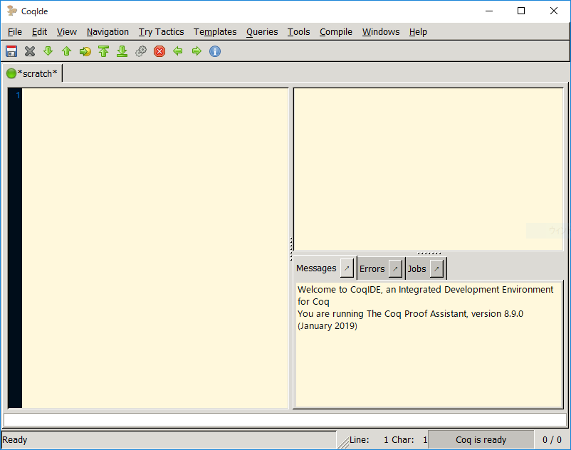

# アイマスを「証明」してみる話
<p class="right">著:きりだるま</p>

## アイマスを「照明」する

「アイマス最高！」と事あるごとに言い続けている我々プロデューサーですが、本当にアイマスは最高なんでしょうか？
疑問に感じたので、Coq(8.9.0)を使って証明しようと思います。

## お断り

理論や実際に役に立つことは書きません(書けません)

- Coqっていうのがあるんだ
- Coqってこんなことができるんだ
- いや、その論理はおかしい()

という雰囲気ですので、面白半分です。

## セットアップ

### インストール

難しくないです。
GitHubのreleaseページからインストーラを引っ張ってきて、実行すればいろいろ入ります。

https://github.com/coq/coq/releases

基本的にCoqIDEというのを使うのが普通のようです。
今回もそれに倣い、CoqIDE上で進めていきます。

### Coqの使い方(CoqIDEの使い方)

CoqIDEを開くと、こんなウィンドウが表示されると思います。



左側の大きなスペースがスクリプトを記述していく箇所です。
右上は証明モードで使用します。
また、右下はエラーやCoqからのレスポンスやエラー等のメッセージが表示されるスペースです。

基本的に、左側のスペースにスクリプトを記述していき、
ウィンドウの上部にある緑の矢印をポチポチして、1行ずつスクリプトを読み込み/巻き戻しして試行錯誤しながら、プログラミングや証明を行っていきます。

### Coqの学び方

知りません。
多分、本や各種ネット上の記事等を見ると良いと思います。

Coqは全く詳しくないです。
論理学も全くの専門外です。
自分は単にアイマスを「証明」したいというモチベーションでやっています。

## 証明してみる

### 論理の"Hello, World"、三段論法

プログラムであれば最初は"Hello, World"だと思うんですが、Coqで"Hello, World"をするのは難しいようです。
なので、ここは論理の"Hello, World"ともいえる**三段論法**を証明したいと思います。
「ソクラテスは人間、人間はいつか死ぬ、なのでソクラテスはいつか死ぬ」というやつですね。

まず、証明の全体像を載せておきます。

```coq
Theorem idol_is_cute: forall (Hibiki Idol Cute : Prop),
(Hibiki -> Idol) -> (Idol -> Cute) -> (Hibiki -> Cute).
intros.
apply H0.
apply H.
apply H1.
Qed.
```

さて、少し解説していきます。
Theoremというのは定理という意味で、これはCoqを証明モードにするワードです。
idol_is_cuteは今から証明しようとしている定理の名前です。
Coqでは、証明した定理に名前を付けて後から使用したりもできます。

その次のforallから最後のピリオドが証明したい式です。
順に見ていきましょう。

forallは「任意の」にあたるワードです。
数学記号でいうところの`∀`ですね。
forallはその次の括弧にかかっています。
`Hibiki Idol Cute : Prop`となっていますが、これは`Hibiki、Idol、Cuteという命題を宣言する`という感じの意味です。
つまり、ここは「任意の我那覇響、アイドル、可愛いという命題について...」という証明したい定理の条件を表しています。

その次にあるものが証明したい式の実態です。
`(Hibiki -> Idol) -> (Idol -> Cute) -> (Hibiki -> Cute)`となっています。
`->`はその前後の命題について「〇〇ならば××」という意味です。
つまり、この部分は「(我那覇響ならばアイドル)、(アイドルならば可愛い)、ならば(我那覇響ならば可愛い)」という意味になります。

Coqでは、証明したい式が真(正しい)ということを証明していきます。
なので、最初の1行をざっくりと日本語化すると

```
定理、アイドルは可愛い(
    任意の我那覇響、アイドル、可愛いについて、
    我那覇響はアイドル、アイドルは可愛い、よって我那覇響は可愛い
)は真である。
```

みたいな感じになります。
これを読んでいるプロデューサーなら分かる通りこれは自明ですね。
ですが、最初なのでチュートリアルもかねて順に見ていきましょう。

ツールバーにある緑の下向きの矢印を一度押すと、一行読み込めます。
一度押すと、`Theorem...`の行が読み込まれて、CoqIDEが証明モードに移ります。

```
1 subgoal
______________________________________(1/1)
forall Hibiki Idol Cute : Prop,
(Hibiki -> Idol) -> (Idol -> Cute) -> Hibiki -> Cute
```

おそらく、こんな風に表示されていると思います。
真ん中の傍線で仕切られた上の部分は今は空ですが、証明を進めていくうちに、証明するのに使用できる仮定や命題のリストが表示されます。
傍線で仕切られた下の部分は、現時点での証明対象の式が表示されます。
基本的に証明モードでは、証明対象の式を簡約化しつつ使用出来る仮定や定理を増やしていき、それらを使って証明を進めていきます。

それでは早速証明を行っていきます。
もう一度緑の下矢印のボタンを押すと、こんな風に出力が変わると思います。

```
1 subgoal
Hibiki, Idol, Cute : Prop
H : Hibiki -> Idol
H0 : Idol -> Cute
H1 : Hibiki
______________________________________(1/1)
Cute
```

使用出来る命題が増えて、証明対象の式が一気に簡約化されました。
証明モードでは**tactic(タクティック)**と呼ばれる操作を行って証明を進めていきます。
3行目のintrosは、証明対象の式中の`forall...`や`A -> B`の形の部分を全てばらしてくれるタクティックです。

さて、証明対象の式がばらされた結果、証明に使用出来る「武器」がたくさん手に入りました。
ザーッと手持ちの武器を見た感じ、このまま一気に証明できそうなのでやっていきましょう。
緑の下矢印のボタンをもう一度押すと、下のように変化すると思います。

```
1 subgoal
Hibiki, Idol, Cute : Prop
H : Hibiki -> Idol
H0 : Idol -> Cute
H1 : Hibiki
______________________________________(1/1)
Idol
```

4行目の`apply 〇〇`は、「命題〇〇を証明対象の式に適用する」というタクティックです。
ここでは、`H0 : Idol -> Cute.`という命題を適用しています。
この`H0`という命題は、3行目のintrosタクティックによって自動的に生成された命題です。

さて、これにより、証明対象の式が`Cute`から`Idol`に変化しました。
どんどんやっていきましょう、緑の下矢印のボタンをもう一度押すと、先ほどと同じく下のように証明対象の式が変化すると思います。

```
1 subgoal
Hibiki, Idol, Cute : Prop
H : Hibiki -> Idol
H0 : Idol -> Cute
H1 : Hibiki
______________________________________(1/1)
Hibiki
```

次は`H : Hibiki -> Idol`という命題を適用しました。
もう一息です。
もういちど緑の下矢印のボタンをもう一度押すと、下のようになると思います。

```
No more subgoals.
```

「これ以上、証明対象の式はありません」
つまり、これで「我那覇響は可愛い」という定理を証明したことになります。
最後にもう一度緑の下矢印のボタンを押して、高らかにQedを宣言しましょう。
`Qed.`と打ち込むことによって、証明モードが終了します。
