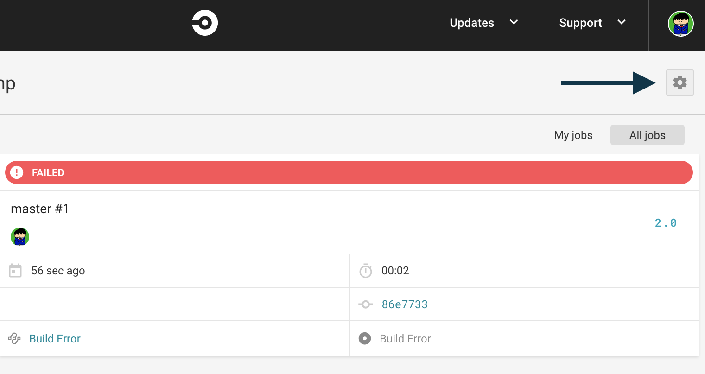
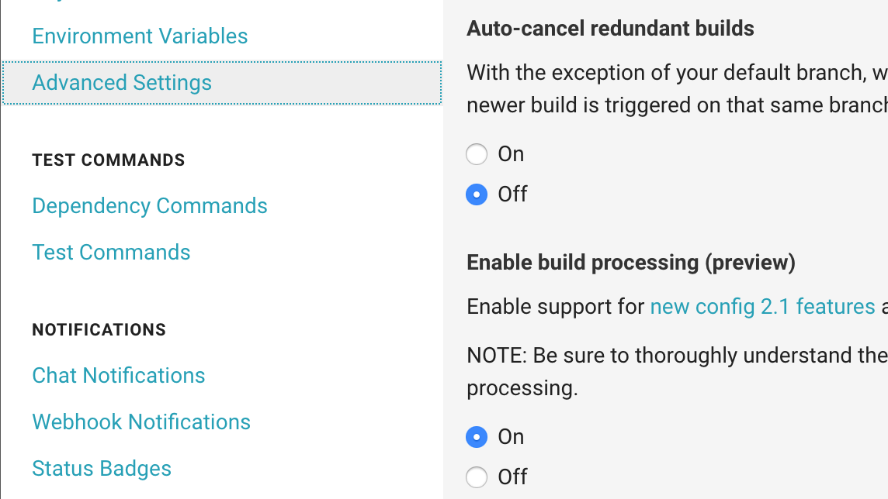
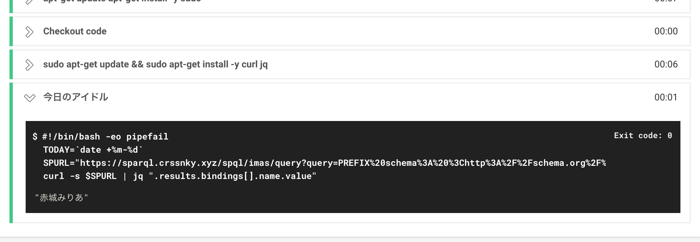

# CircleCIでアイドル情報を出力させて生産性を上げる話
<p class="right">著:.ごっち</p>

## 本チャプタの対象者

- なにかしらソフトウェアを開発しているエンジニア
- GitHubを利用してソースコードや文書を管理している人

## はじめに

この本を読んでいるプロデューサーエンジニアのみなさんはだいたい副業でエンジニアをやっているかたがほとんどだと思われます。とくにWeb、ネイティブアプリ、ゲームなどといったソフトウェアを開発していると思います。

開発をする中で生産性をあげるツールとしてCIがあるのですが、CIを使用してアイドル情報を取得することでプロデューサーエンジニアとしてより生産性が上がると思いませんか？

今回はアイドルの情報の中でも、CircleCIを使用して「今日が誕生日のアイドルを取得する」方法について触れます。

<footer>\*1：https://circleci.jp/</footer>
<footer>\*2：https://circleci.com/orbs/</footer>

## CircleCIとは

CircleCI(\*1)とは継続的なインテグレーションサービスの一つです。コミットからテスト、デプロイなどユーザが設定した情報を元に自動で行うことができます。

CircleCIにはCircleCI Orbs(\*2)というCircleCIの設定ファイルのコマンドや設定などの共通処理を使い回すことができる仕組みがあります。この仕組みの使い方は「あるRuby on Railsのプロジェクトのテストコマンドは他のRuby on Railsのプロジェクトとほぼ同じだから使い回したい」ときや「あるPythonのプロジェクトのライブラリ読み込みコマンドは他のPythonのプロジェクトとほぼ同じだから共通化したい」といったことがあったときにとても有用です。

この仕組みを利用して著者が作成した「今日が誕生日のアイドルを出力する」のOrbsを導入してみます。

今回はCircleCIの詳しい使い方には触れません。

## 著者が実装したOrbsを導入する

最初に作業の流れを確認します。

1. GitHubにリポジトリを作る
1. CircleCIにサインアップする
1. CircleCIにプロジェクトを追加する
1. CircleCI 2.1を有効にする
1. `.circleci/config.yml` を書く
1. GitHubにpushしてCircleCIの実行結果を確認する
1. CircleCIの実行結果を見てみる

### GitHubにリポジトリを作る

GitHubにリポジトリを作ります。すでに作成されたリポジトリで試す場合はここではとくに何もしません。

### CircleCIにサインアップする

https://circleci.jp/ にアクセスをしてサインアップします。すでにアカウントがある場合はそれを使用しても構いません。

### CircleCIにプロジェクトを追加する

プロジェクトを追加します。GitHubのリポジトリを検索して `Set Up Project` をクリックします。


セットアップページが表示されますが、ここではなにもせずに `Start building` をします。(ここでbuildをしても必ず失敗するので、失敗のログを残したくないのであれば次に設定する`.circleci/config.yml`を作成し、exampleにあるコードを書いてGitHubにプッシュします)

### CircleCI 2.1を有効にする



`Start building`をクリックしたあとに表示されるページの右上の歯車アイコンからプロジェクトの設定をします。

その中にある `Advances Settings`から `Ennable build processing (preview)`を有効にします。



### `.circleci/config.yml` を書く

ここで実際に設定を書いていきます。 `.circleci/config.yml`に以下のコードを書きます。この設定で「今日が誕生日のアイドルを取得する」ことができます。

```yml
version: 2.1
ubuntu_image: &ubuntu_image
  ubuntu:18.04
install-sudo: &install-sudo |
  apt-get update
  apt-get install -y sudo
orbs:
  todays-imas-idol: yutagoto/todays-imas-idol@1.0.0

executors:
  ubuntu-docker:
    docker:
      - image: *ubuntu_image
        environment:
          TZ: Asia/Tokyo

jobs:
  echo:
    executor: ubuntu-docker
    steps:
      - run:
          command: *install-sudo
      - todays-imas-idol/echo-todays-imas-idol

workflows:
  main:
    jobs:
      - echo
```

上記はubuntuを使用していますが、各プロジェクトに合わせて使用するimageを変更してください(著者のrubyのプロジェクトでも動作確認はできています)。

#### それぞれの設定コードの解説

```yml
version: 2.1
```

使用するCircleCIのバージョンを指定します。

```yml
ubuntu_image: &ubuntu_image
  ubuntu:18.04
install-sudo: &install-sudo |
  apt-get update
  apt-get install -y sudo
```

この設定ファイルで使用する変数を定義します。デフォルトのubuntuではデフォルトでsudoがインストールされていないのでsudoをインストールしていますが、sudoを使える環境であればこの設定は不要です。

```yml
executors:
  ubuntu-docker:
    docker:
      - image: *ubuntu_image
        environment:
          TZ: Asia/Tokyo
```

実行環境の情報を定義して再利用するコードを定義します。

```yml
orbs:
  todays-imas-idol: yutagoto/todays-imas-idol@1.0.0
```

使用するOrbsを定義します。今回は yutagoto/todays-imas-idol&#64;1.0.0(\*3)を使用します。

<footer>\*3：https://circleci.com/orbs/registry/orb/yutagoto/todays-imas-idol</footer>

```yml
jobs:
  echo:
    executor: ubuntu-docker
    steps:
      - run:
          command: *install-sudo
      - todays-imas-idol/echo-todays-imas-idol

workflows:
  main:
    jobs:
      - echo
```

実際に処理する内容になります。 `jobs:`でそのjobの名前(この場合は`echo`)と、`workflows:`で処理する順番を定義します。

`jobs`の`steps`に `todays-imas-idol/echo-todays-imas-idol` を書きます。

#### GitHubにpushしてCircleCIの実行結果を確認する

GitHubにpushして、CircleCIの実行結果をみてみます。



ここで今日が誕生日のアイドルを確認することができます。今日が誕生日のアイドルがいない場合はnullが出力されます。

## yutagoto/todays-imas-idol&#64;1.0.0 の他の使い方

いままでの例ではCircleCIの実行結果に標準出力してアイドルを確認していましたが、このOrbsにはSlackやDiscordへの通知にも対応しているので、わざわざ実行結果のページに遷移しなくともアイドルを感じることができます。くわしい使い方はOrbsのページ(\*4)を参照してください。以下にSlackへの通知の実行結果の例を載せます。


<footer>\*4：https://circleci.com/orbs/registry/orb/yutagoto/todays-imas-idol</footer>

## おわりに

これで一通り「今日が誕生日のアイドルCircleCIで出力する」をマスターしました。CIツールの導入により生産性が上がる中で、アイドル情報を得られるということでさらに生産性が上がったような気がしませんか？

このCirclrCI OrbsはGitHubに公開(\*5)していますので、もしバグを発見したときや新規機能を追加したいときはPull Requestを作成してください！

本業のみならず副業の生産性もどんどん上げて、より質の高いプロダクトを作っていきましょう！

<footer>\*5：https://github.com/YutaGoto/todays-imas-idol-orb</footer>

## おまけ

今後 実装していきたいものの案として、

- GitLab CIやTravis CIなど他のCIサービスへの展開
- ランダムでアイドルとそのアイドルの趣味や好きなことを出力させるCircleCI Orb
- 今日が過去のライブと同じ日だったライブを出力させるCircleCI Orb
- 今日が誕生日のアイドルを取得するJavaScriptやRubyなどのライブラリ

などを考えています。
