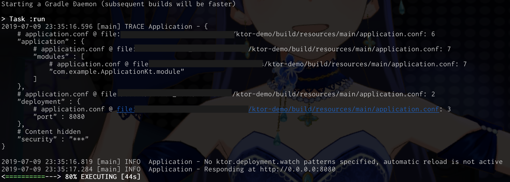

# 小鳥さんと一緒に100%Kotlinのサイト製作<br><span class="subtitle">〜Backend編〜</span>
<p class="right">著:にしこりさぶろ〜</p>

_前回のあらすじ！_(\*1)

新しいコーポレートサイトを発注した765プロダクション。発注先はとある売れっ子俳優のHPも手がけたデザイナーともあり、期待に胸膨らませる高木社長と事務員・音無小鳥。しかし入稿日、送られてきたサイトは軽さと速度、そしてコンプライアンス(=Javascript使ってない的な意味で)のためにその他全てを犠牲にした、日本人的侘び寂びを体現するかのごとく質素で簡素な何かだった！


<center>図1. 765プロ新コーポレートサイト</center><br/>

「このままではいけない！」立ち上がったのは、つい先日転職してきたばかりの新人Pだった！小鳥から告げられたデッドラインは3日後。即席デスマーチも、アイドル達の笑顔のためならなんのその！前職のエンジニアの経験をフルに活かし、人生何度目か分からない3徹を乗り越え、新人Pはどうにか765プロの危機を救ったのである。

事務所の机に突っ伏す新人P。起こさないようにと、小声でPをねぎらう小鳥の目に入ったのはディスプレイに映る「Kotlin」の文字。そう、このP、華麗なジョブチェンジの後もなお、Kotlinを愛し、その発展に貢献せんとする1人の技術者だったのだ。

<footer>\*1 前回: https://youtu.be/8oB-JudUejE?t=6360 (IM@S Engineer Talks 2019)</footer>

「Kotlinを愛するプロデューサー、これは最早、事務所の同僚を超えた、赤い糸で結ばれた関係…！」そう悟った小鳥は、目を覚ましたPにありったけの熱意を携え、こう告げるのだった。

<center><strong>「私に、Kotlinを教えてください！」</strong></center><br/>

## Kotlinとは...

#### 小鳥
さて、Pさん。早速なんですが…。

#### P
はい、音無さん。どうしました？

#### 小鳥
…Kotlinって何か教えていただけますか…？そもそもプログラミングが何かも、全く分からなくて…。

#### P
…まぁ、そうですよね。良いですよ、1からしっかり教えますから！

Kotlinは、チェコに本社を置くJetBrains社が開発している、静的型付けのオブジェクト指向プログラミング言語なんです。JVM上で動作をして、Javaよりも簡潔かつ安全にコーディングができるよう、文法が設計されています。実際の開発現場における実用性に、かなりの主眼を置いているのが大きな特長ですね。その証拠と言ってはなんですが、型推論が非常に優秀だったり、Null安全やシングルトンが言語レベルでサポートされていたり…。

#### 小鳥
じ、じぇーぶい…、かたすいろん…、ちょっとあの、Pさん…？置いていかないでください…。

#### P
あっ、すいませんつい…。

そうですね。僕があれこれ講義するより、とりあえず動くものを作った方がいいかも知れないですね！まずはサーバーサイドKotlinで、「Hello, World!」を作ってみましょう！


## KtorでHello, World!

#### 小鳥
え？そんないきなり、私に作れますか…？Excel方眼紙との闘いなら負けませんけど…。

#### P
ブラウザとエディタがあれば問題なしですよ。それに、765プロのPC、ブラウザもエディタも全部、僕が入社初日にChromeとVSCodeに置き換えておきましたから！

じゃあまずは、「Ktor Project Generator」にアクセスしましょう。

#### 小鳥
えーっと、このサイト、ですか？なんだかチェックボックスがたくさんありますね…。


<center>図2. Ktor Project Generator(\*2)</center><br/>

<footer>\*2 https://start.ktor.io</footer>

#### P
そうですそうです！ひとまずチェックボックスは無視して、左下の青い「Build」ボタンを押してください。

#### 小鳥
あ、zipファイルがダウンロードされましたね！これを…？

#### P
適当なところで解凍しちゃってください。中に「Application.kt」って名前のファイルがあると思うんですけど…。解凍したフォルダの「src」フォルダの中に…。

#### 小鳥
ありました！善は急げ、開いちゃいますね！

```kotlin:Application.kt
package com.example

import io.ktor.application.*
import io.ktor.response.*
import io.ktor.request.*

fun main(args: Array<String>): Unit = io.ktor.server.netty.EngineMain.main(args)

@Suppress("unused") // Referenced in application.conf
@kotlin.jvm.JvmOverloads
fun Application.module(testing: Boolean = false) {
}
```
<center>コード1. Application.kt(解凍したて)</center><br/>

#### 小鳥
ぴ、ぴよ…、何も、わからないです…。

#### P
まぁまぁ、最初はみんなそんなもんですよ。まずは動くもの、ですよ！

えーっと、それじゃあこのファイルの中括弧の中にプログラムを書いて欲しいんですけど、僕の教える通りに書いてもらってもいいですか？

#### 小鳥
は、はい！お願いします！

```kotlin:Application.kt
package com.example

import io.ktor.application.*
import io.ktor.response.*
import io.ktor.request.*
import io.ktor.http.*
import io.ktor.routing.*

fun main(args: Array<String>): Unit = io.ktor.server.netty.EngineMain.main(args)

@Suppress("unused") // Referenced in application.conf
@kotlin.jvm.JvmOverloads
fun Application.module(testing: Boolean = false) {
    routing {
        get("/") {
            call.respondText("Hello, World!", ContentType.Text.Plain)
        }
    }
}
```
<center>コード2. Application.kt(Hello, World!を返すように)</center><br/>

#### 小鳥
こんな感じ、ですか？

#### P
はい、良いと思います！ここまで来たら最後に、こっちの黒い画面でこのコマンドを実行してもらえます？

#### 小鳥
えーっと、こう、ですか？

```
$ ./gradlew run
```


<center>図3. サーバー立ち上げコマンド実行後</center><br/>

#### 小鳥
何か、動いてますね…。よくわからないけど、ハッカー？になった気持ち…。

#### P
よし、ひとまずこれで完成！です！

#### 小鳥
え？もう完成ですか？

#### P
試しに、ブラウザで「localhost:8080」って直接打ち込んで、アクセスしてみてください！


<center>図4 Hello, World!</center><br/>

#### 小鳥
え！す、すごいです！「Hello, World!」って表示されてます！

#### P
どうですか！？簡単ですよね！？じゃあ試しに、「Hello, World!」を「こんにちは、Kotlin!」に書き換えてみてください。


<center>図5. こんにちは、Kotlin!</center><br/>

#### 小鳥
さっきと表示される文字が変わりました！

#### P
よし、じゃあ次は、さっきのプログラムにもう少し追記してみましょう。こんな感じで。

```kotlin:Application.kt
    routing {
        get("/") {
            call.respondText("Hello, World!", ContentType.Text.Plain)
        }
        get("/today") {
            call.respondText("今日の天気は晴れ", ContentType.Text.Plain)
        }
    }
```

<center>コード3. Application.kt(ルーティング追加)</center><br/>

#### 小鳥
できました！

#### P
OKです！それじゃ、今度は「localhost:8080/today」にアクセスしてみてください。


<center>図6. 今日の天気は晴れ</center><br/>

#### 小鳥
また表示が変わりました！あれ…？でも「localhost:8080」に戻ると、さっきの「こんにちは、Kotlin!」が表示される…！何だか、Webサイトっぽいですね！

#### P
ですよね！さて、今日は最初ですし、このくらいで終わりにしようと思いますが。どうです？

#### 小鳥
すごく楽しいです！まだ短い文字を出すだけですけど、これから色んなことが
できそうな気がして、わくわくしちゃいます！

#### P
そう思ってくれたら嬉しいです！次回以降、僕もどうやったら楽しみながらKotlin勉強できるか、色々考えてみますね。

#### 小鳥
よろしくお願いします！今日はありがとうございました。

## 補足コーナー
「小鳥さん=ITガチ初心者」の想定で書いたので、技術濃度がかなり薄くなってしまった(´・ω・｀)　なので、SSに登場したフレームワーク・Ktorについて補足します。

### What is Ktor?
**Ktor(\*3)とは、軽量かつシンプルなKotlin製Webアプリケーションフレームワーク**です。2018年11月にバージョン1.0がリリースされたばかりの新しいフレームワークであり、現在でも活発に開発が進んでいます。

Ktorは、前述までのサーバーサイドのアプリケーション開発以外にも、HttpやWebSocket等の外部サービスとの接続のための非同期クライアントの機能もサポートしています。最近では、**DroidKaigi 2019の公式アプリ(\*4)**がHttpクライアントにKtorを採用した事例もあり、サーバーサイド・クライアントサイドの両面で利用実績が増えつつあるフレームワークだと言えるでしょう。

### ルーティングの記述

KtorによるGET・PUT・POSTといったルーティングの記述は、`routing`メソッドを使って以下のように書くことができます。

```
routing {
    get("/") {
        call.respondText("Hello, World!", ContentType.Text.Plain)
    }
    put("/item/{id}") {
        val itemId = call.parameters["id"]
    }
    post("/route") {
        // data class HelloWorld(val hello: String)が宣言済みと仮定
        // ContentNegotiation(後述)も設定済みと仮定
        val data = call.receive<HelloWorld>()
    }
}
```
<center>コード4. ルーティング記述例</center><br/>

<footer>\*3 https://ktor.io/</footer>
<footer>\*4 https://github.com/DroidKaigi/conference-app-2019</footer>

また、`route`メソッドを使うことで、URLパスにprefixを付けることも可能です。

```
routing {
    route("/api/v1") {
        get("/home") { ... }
        get("/post/{id}") { ... } 
    }
}
```
<center>コード5. パスへのprefix</center><br/>

パラメーターやリクエストボディの値の取得は、`call.parameters["hoge"]`や`call.receive<Hoge>()`で取得することができます。URLパスに関しては、下記4つのパラメーターのoptional指定やワイルドカードに対応しています。

- {param?}: パラメーターのoptional指定。
- \*: ワイルドカード。1文字以上のセグメントにマッチします。
- {...}: URIの末尾までの残りにマッチする。
- {param...}: URIの末尾までの残りのセグメントをパラメーターとして受け取る。値は`call.parameters.getAll("param")`のように受け取る。

### JSONを受ける、JSONを返す
POSTでJSONのリクエストボディを受け取りたい時、またはレスポンスとしてJSONを返したい時、Ktorでは**ContentNegotiation**に各種JSONのコンバーターを設定します。

公式ではGson(\*5)とJackson(\*6)の対応モジュールが用意されています。今回はGsonの例を紹介します。

まず、GradleにGson用コンバーターのモジュールを追記します

```
dependencies {
    implementation "io.ktor:ktor-gson:$ktor_version"
}
```
<center>コード6. ktor-gsonへの依存関係追加</center><br/>

<br/>

<footer>\*5 https://github.com/google/gson</footer>
<footer>\*6 https://github.com/FasterXML/jackson</footer>

次に、Application.ktの`routing`の記述の手前に、下記のコードを追記します。

```
install(ContentNegotiation) {
    gson {
        // Gsonの設定記述
        // 例: serializeNulls()
    }
}
```
<center>コード6. ContentNegotiationの設定</center><br/>

最後に、`call.respond()`メソッドでレスポンスを記述し、完了です。

```
data class Character(val first: Name, val family: Name)

routing {
    get("/character") {
        // GET /character で{"first": "小鳥","family": "音無"}が返る
        call.respond(Character("小鳥", "音無"))
    }
}
```
<center>コード7. JSONを返すレスポンスの記述</center><br/>

このように、Gsonの存在を意識することなく、JSONを使った値のやりとりが簡単に実装できます。最高ですね！

複雑なオブジェクトをシリアライズする場合はGsonのTypeAdapterを用意する必要がありますが、これも`gson { ... }`の中で設定することが可能です。

```
install(ContentNegotiation) {
    gson {
        registerTypeAdapter(HogeTypeAdapter())
    }
}
```
<center>コード8. TypeAdapterの設定</center><br/>

### HTMLを返す
Ktorには、Kotlinで記述したHTMLをレスポンスとして返す機能も存在します。この機能は、HTML用のKotlin DSLモジュールをGradleに追記することで利用可能になります。

```
dependencies {
    implementation "io.ktor:ktor-html-builder:$ktor_version"
}
```
<center>コード9. ktor-html-builderへの依存関係追加</center><br/>

上記モジュールを追加すると、`call.respondHtml`というメソッドが利用できるようになり、Kotlinで定義されたDSLを使って返したいHTMLを自由に記述することが可能になります。

```
call.respondHtml {
    head {
        title { +"UNI-ON@IR!!!! Fairy Station" }
    }
    body {
        h1(id = "music") {
            +"FairyTaleじゃいられない"
        }
    }
}
```
<center>コード10. HTMLをレスポンスとして返す</center><br/>

ktor-html-builderは、内部で**kotlinx.html(\*7)**というライブラリを使い、HTML用のDSLの機能を提供しています。このライブラリの実装を読むと、Kotlinの特長の1つである「DSLの作成に有用な機能が揃っている」ことを実感できると思います。興味があれば調べてみてください。

<footer>\*7 https://github.com/Kotlin/kotlinx.html</footer>

### パラメーターの型チェック

JVM言語であるKotlinでサーバーサイドの実装をする上で、パラメーターの型バリデーションは是非とも導入したい機能の1つでしょう。こちらも、リクエストパラメーターの型バリデーションに絞った上で紹介していきます。

リクエストパラメーターの型バリデーションは、ktor-locationsというモジュールを利用し、導入します。まずは、Gradleに依存関係を追記します。
```
dependencies {
    implementation "io.ktor:ktor-locations:$ktor_version"
}
```
<center>コード11. ktor-locationsへの依存関係追加</center><br/>

ktor-locationsの基本的な使い方は、以下の2点です。
- `@Location`アノテーションにパスを記述する。
- `@Location`の次の行にdata classを宣言し、型情報を指定する。

実際のコードは以下のようになります。

```
routing {
    @Location("/live/{title}/{seq}")
    data class LiveMusicParams(val title: String, val seq: Int)
    get<LiveMusicParams> { params: LiveMusicParams ->
        if (params.title == "million6th_angel" && seq == 1) {
            call.respondText("Angelic Parade♪")
        } else if (params.title == "million6th_princess" && seq == 1) {
            call.respondText("Princess Be Ambitious!!")
        } else if (params.title == "million6th_fairy" && seq == 1) {
            call.respondText("FairyTaleじゃいられない")
        } else {
            call.respondText("(o・∇・o)")
        }
    }
}
```
<center>コード12. ミリオン6thの1曲目を返すAPIサーバー</center><br/>

若干記述量が増えますが、シンプルなデータクラスの宣言のみでバリデーションを実装できるため、手軽さを感じられるのではないでしょうか。

### おわりに

小鳥さんとKotlinでイチャつくSS、それからシンプルなAPIサーバーをKtorで実装するためのTipsの2本立てでお送りしました。いかがだったでしょう？

Kotlinはかわいい言語です。書いていて、幸せを感じる言語です。

小鳥さんはもちろんかわいいです。事務員の今もかわいいですし、高校生時代はホントマジでヤバイです。小鳥さんの学生時代を知らないそこのあなたは、早く「朝焼けは黄金色」(\*8)を765万回読んでください。

**かわいい言語であるKotlinと、存在そのものがかわいい小鳥さん、両者が掛け合わさった時、この世に新たな宇宙が誕生します。**読者のみなさんも、これを機に小鳥さんと一緒にKotlinに触れ、かわいいの先に見える未知の世界を体験してみてください。

(真面目な話、世の中Kotlin書けるエンジニアがマジで見つからなくて本当に採用大変なんだ！！！つらい！！！これ読んだプロデューサーさんは、頼むからみんなKotlin書いてくれ！！！お願いします！！！)

<footer>\*8 http://data.ichijinsha.co.jp/book/booksearch/booksearch_detail.php?i=75806708</footer>

