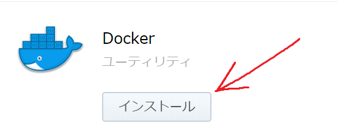
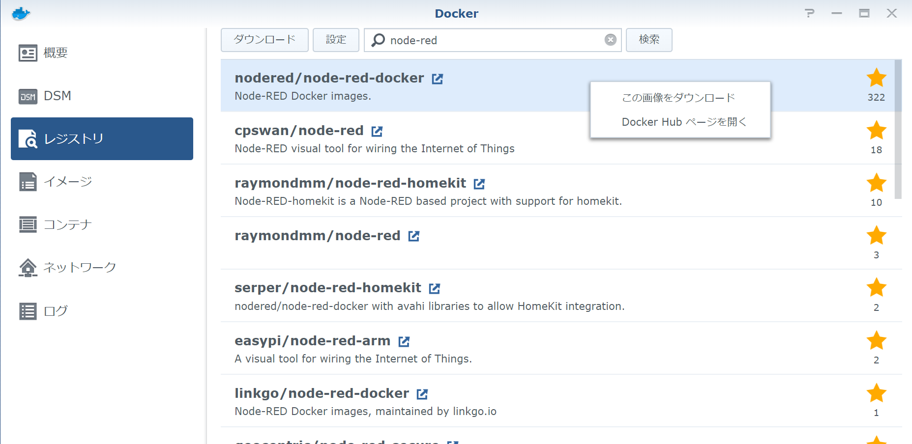
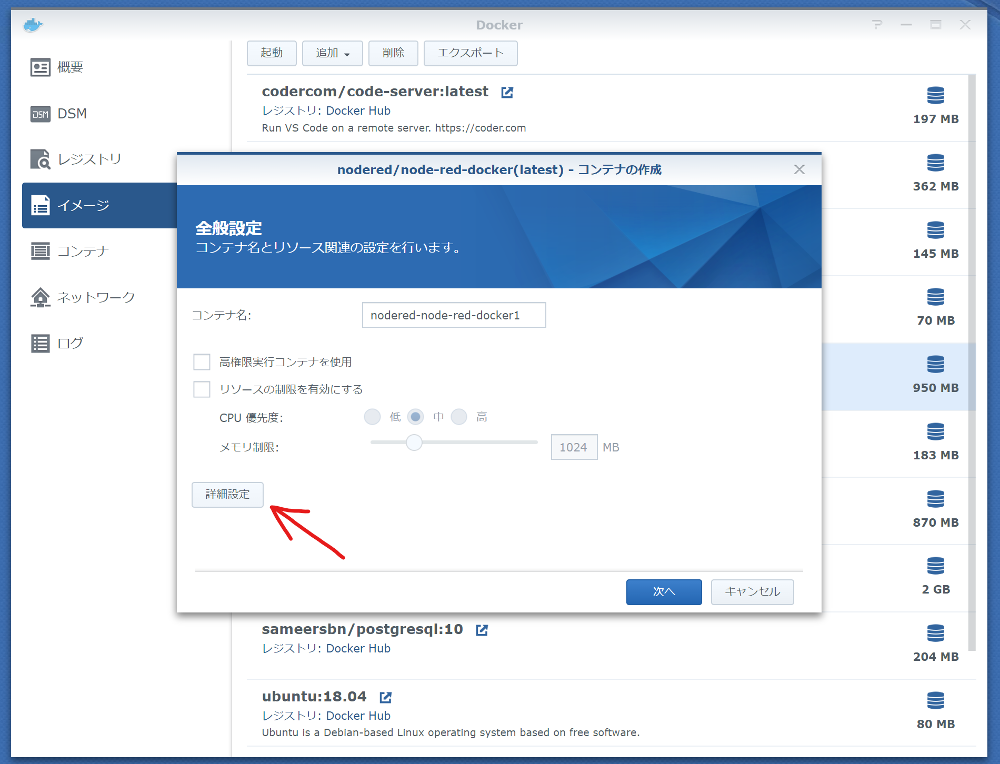
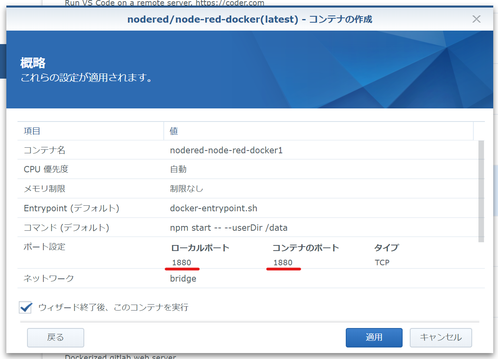
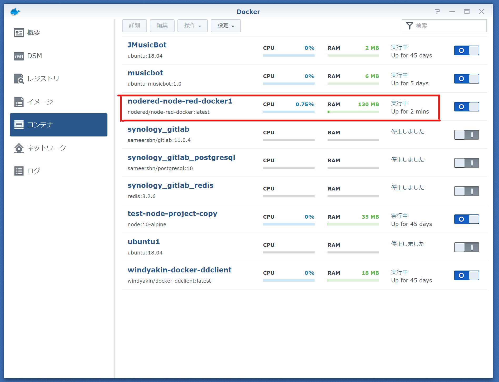

# プレイリストを自動生成

著:Wakuwaku

## はじめに

### 対象者

- アイマスの曲が多すぎて困っている方
- Synology社のNASを購入する予定・持っている方

### このChapterを読むにあたっての注意点
- Synology社のNASを持っている必要があります

## 問題

現在僕が管理している音楽トラックはアイドルマスターのみで(ラジオCD・ドラマCD・カバー・BGMを含み)6000を超えている。
これほどたくさんあったら聴く曲の偏りが発生するだろう。

僕の場合音楽を聴くときよくあるパターンとして以下の4つある。

- 新しくリリースされたCD
- いつものプレイリスト
- 10th LIVE プレイリスト
- Re:ステージ!全曲シャッフル

これでは多くても100曲程度になってしまう。

NASでどこでもライブラリ内の曲すべてを聴くことができる環境を構築したというのにもったいない。

## 解決方法

何かしらの規則でプレイリストを作成すれば，1年間でより多くの曲を聴けるのではないか。

アイドルの誕生日を使えば祝いながら楽しくアイマスの世界に浸れるかもしれない。

## 実装

### 0. 今回使うもの

- im@sparql
- Synology DS918+
  - Audio Station
  - Docker
  - Node-RED

### 1. NASにDockerをインストール

#### 1-1. DSMにログインしてパッケージセンターを起動する

#### 1-2. `Docker`で検索

#### 1-3. Docker をインストール

`インストール`をクリックしたら自分の環境に合わせてインストール先の設定を求められる場合がある。

### 2. Node-REDの準備

#### 2-1. Docker Image 「nodered/node-red-docker」のダウンロード

- レジストリを開いて`node-red`で検索。
- nodered/node-red-dockerをダウンロード。

#### 2-2. Docker Container を立ち上げる

- イメージを開いて`nodered/node-red-docker:latest`をクリック。
- 起動ボタンを押す。
- ウィンドウが開くので詳細設定を押す。

- コンテナと通信するためのポート設定をする。ここではNode-REDと同じ`1880`に設定する
- 設定したポート番号でNode-REDにアクセスできる。
- 設定したら`適用`をクリックし，詳細設定ウィンドウを閉じる。

- コンテナ作成ウィンドウに戻り，`次へ`をクリックする。
- ポート設定が正しくできているかチェックする。
- 適用をクリックして，コンテナを起動する。

- コンテナを開き，node-redのコンテナが立ち上がっているか確認する。

#### 2-3. Node-RED接続確認

- `http://{NAS_IP}:1880`にアクセスする。

### 3. 誕生日のアイドルを取得する

### 4. NASに保存してある曲を取得する

### 5. NASにプレイリストを登録する

### 6. Slackに通知をする

## 終わりに
