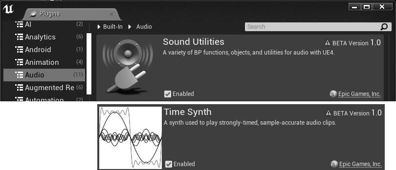

# UE4でアイマス楽曲をさらに盛り上げてけ☆
<p class="right">著:croMisa</p>

## はじめに
Unreal Engine 4(以下UE4)は、Epic Gameが開発する商用ゲームエンジンです。モバイル向けのゲームのほとんどはUnity製ですが、大規模タイトルでは国内でも採用されています。アイマスと関わりの深い(\*1)エースコンバットシリーズの最新作でも採用されています。最近はゲームエンジンを、3DCG表示ソフトウェアの統合開発環境として使用することが増えています。UE4ではそのような非ゲーム向け用途を「エンタープライズ用途」と名付け、様々な機能を盛り込んでいます。

今回は、UE4を使ってゲームではなく、アイマス楽曲を盛り上げるためのソフトウェアの簡単な例を作成します。この例を発展させることで将来的には、VJ(Visual Jocker)で使用できるような映像表現を獲得できるでしょう。

<footer>\*1：https://idolmaster.jp/blog/?p=10945 など</footer>

## ゴール
完成イメージはこちら。グレースケール画像のため、色感は調整されています。
<center><br/>
図1 完成イメージ</center>

BGMをスペクトル解析しそれを円形に配置されたBoxを伸ばすことで、オーディオスペクトラムを表現しています。流れている音声を周波数領域ごとに大きさを取り出して表示するものです。カーステレオによく表示されているようなアレです。それとは別にBPMに合わせて、中央から△を外側へ放出しています。キャプチャした映像は@croMisaの固定ツイートになっています。(\*2)

完成品はGitHubにあります(\*3)。  

<footer>\*2：https://twitter.com/croMisa/status/1188376656718651392</footer>
<footer>\*3：https://github.com/crssnky/UE4_SoundEffect</footer>

## 開発環境
必要なもの
- Unreal Engine 4  
今回は、バージョン4.23.1で説明します。  
自分でビルド、バイナリの入手、どちらでも構いません。
- Visual Studio 2017/2019 or Xcode  
ビルドしなければ、たぶん無くても良い。たぶん。  
- ローリング△さんかく(WAV形式)  
△・□・○と、プリミティブな形がいっぱい出てくるので。  
その他の楽曲でも構いません。

## 作成
### 下準備
初めに、UE4のプロジェクトを作成します。UE4を起動すると、既存のプロジェクトを選んだり、新規プロジェクトを作成するウィンドウが表示されます。また、初回起動はShaderCompileが走ります(\*4)。ShaderCompileは、可能な限りCPUを使ってコンパイルし、そこそこの時間がかかります。PCは一旦放置し、スマフォでプロデュース業をして待ちましょう。

<footer>\*4：プロジェクト作成後だったかも...</footer>

<center><br/>
図2 Project Window(一部ぼかし有り)</center>

"New Project"タブを選択し、BlueprintのBlankテンプレートを選択します。下の3つのオプションについては、デフォのままで大丈夫です。

<center><br/>
図3 プロジェクト作成</center>

プロジェクトを作成したら一旦UE4を終了し、Configファイルを開きます。
- Windowsユーザ
  - (プロジェクトディレクトリ)/Config/Windows/WindowsEngine.ini
- Macユーザ
  - (プロジェクトディレクトリ)/Config/Mac/MacEngine.ini
  
次の設定を追記します。
```INI
[Audio]
AudioDeviceModuleName=AudioMixerXAudio2
```
最後に、UE4でプロジェクトを開いてプラグインを有効にします。メニューバーから"Edit"->"Plugins"でプラグインウィンドウを開きます。

<center><br/>
図4 プラグインウィンドウを開く</center>

"Audio"カテゴリにある、"Sound Utilities"・"Time Synth"を有効化します。UE4の再起動を求められたら再起動します。

<center><br/>
図5 プラグインを有効化</center>

以上で下準備は終わりです。次から作成に入ります。

### Spectre Visualizer① ～BGMを反映～
SpectreVisualizerをBlueprint(以下BP)で作成します。コンテンツブラウザからBPをActorで作成し、適当な名前を付けてください。  
<center><br/>
図2 BPの作成</center>


### Position based colors ～位置と色相で良い感じの色～

### Niagara① ～ローリング△さんかく～

### Spectre Visualizer② ～BPMを反映～

### Niagara② ～もうちょっとカドを少なく～

### Spectre Visualizer③ ～歌詞を反映～

## おわりに

## 参考
