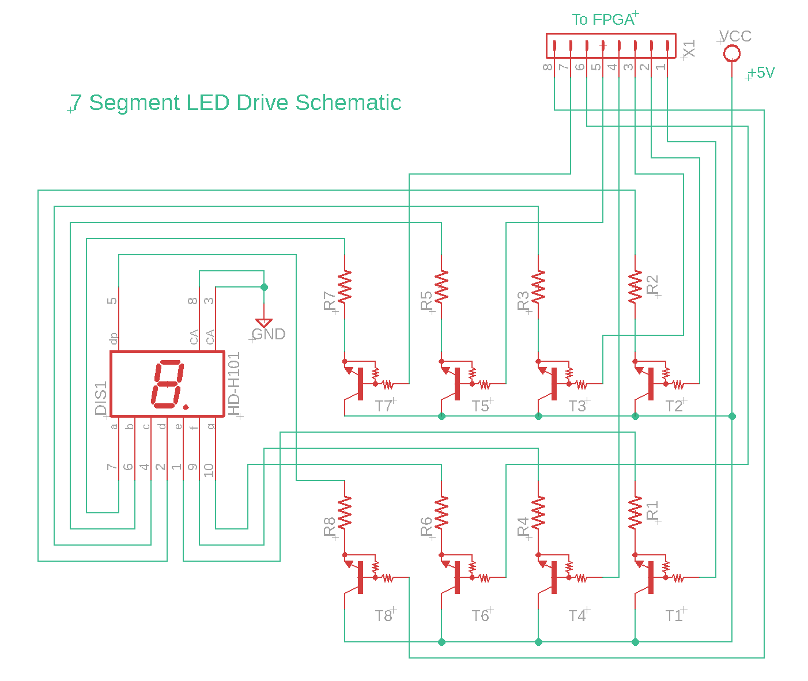
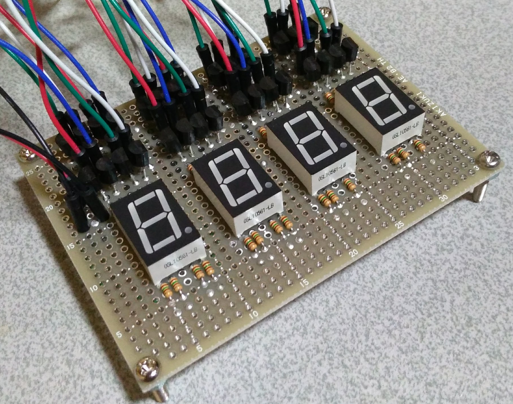
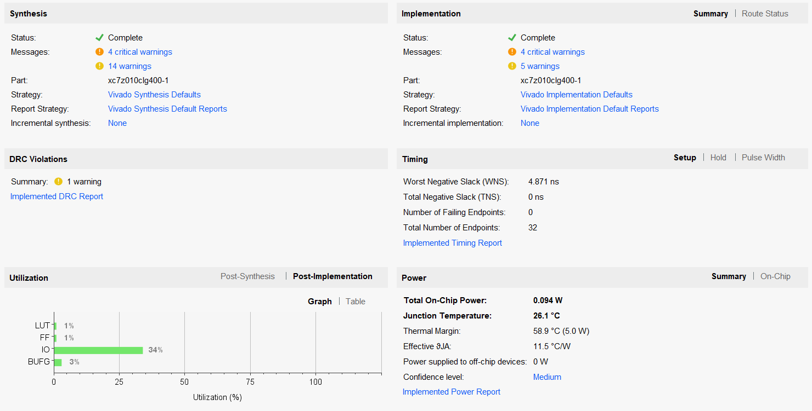

# FPGAでモテモテなハッピーライフをエンジョイしようよ！　by へヴろく


## ねぇねぇ！プロデューサーさん、<br>　今日は一日中おしゃべりしたいな～、ダメ？


## もくじ

- FPGA楽しまないと損だよ～？

- コーディング？　そんなに難しくないよ？

- 765カウンタでハッピーライフに一歩前進！

※若葉マークのみんな（自分）向けの記事だよ。


## FPGA楽しまないと損だよ～？
 プロデューサーさーん！FPGA使ってます？？最近話題の例のアレですよー  言語ベースで回路をつくれるあのデバイス。  最近はARMのコアとHBMメモリーを搭載したりしてるんだよ。

#### 「FPGAは難しい？　ラズパイじゃだめなのって？」

 最初は私もそう思ってたよ。でもねちょっとしたものなら簡単に無料で作ることができるんだよ、使い方に合わせて選んで欲しいなー。この後出てくる765カウンタならラズパイのほうが簡単かもねっ。FPGAをフルに使いこなそうとすると大変だもん。

#### 「どうしてFPGAなのって？」

 リアルタイムに処理ができる事が一番だね。ここのリアルタイムというのがポイント！ピコ秒オーダーでのタイミング調整ができるんだ、めちゃ速く動かすことができるでしょ？

 
## コーディング？　そんなに難しくないよ？
コーディングの言語としてはVerilogがいいかなー。C言語もあるけどまた別の時にしようね。まずはVerilogの文法を覚えよう。今日は回路ベースの書き方をおしゃべりするね。

- #### コメントは「//」か「/* */」で囲う<br>
とにかくコメントは書いておきましょうね、可読性が下がるとか見ればわかるとかは言わないでね。

- #### １ソース１モジュールを守ろう<br>
１つのソースに全部の機能を書くのはやめたほうがいいかな。じゃないとシミュレーションまではうまくいっても、いざ回路に落とし込む場合に謎のエラーに悩まされちゃう。

- #### 割り算はしない<br>
気軽に回路を書けるんだけど演算子に「/」を使うのはやめた方がいいですね。シフト演算のテクニックを使っちゃいましょう。

## 765カウンタでハッピーライフに一歩前進！
プロデューサーさん！LEDカウンタを765仕様でつくってみましょう。

```
【部品】
・FPGA評価ボード
・7セグメントLED
・電流制限抵抗
・デジタルトランジスタ
```

```
【仕様】
右：0→5
中：0→6
左：0→7
```
右が5までカウントアップしたら桁上げして、中を6までカウントアップしたら、左を7までカウントアップして「765」を表示してストップ。
リセットにSW0を割り当てて。OFFでリセットし0点灯、ONでさっきの「765」をカウントするよ。

```
7セグメントLED仕様

  DP,A,B,C,D,E,F,G

DOT = DP            : 8'b1000_0000  
0   = A,B,C,D,E,F   : 8'b0111_1110
1   = B,C           : 8'b0011_0000
2   = A,B,D,E,G     : 8'b0110_1101
3   = A,B,C,D,G     : 8'b0111_1001
4   = B,C,F,G       : 8'b0011_0011
5   = A,C,D,F,G     : 8'b0101_1011
6   = A,C,D,E,F,G   : 8'b0101_1111
7   = A,B,C     　  : 8'b0111_0000
8   = A,B,C,D,E,F,G : 8'b0111_1111
9   = A,B,C,D,F,G   : 8'b0100_1011
E   = A,D,E,F,G     : 8'b0100_1111
```
#### ブロック図


## コーディングする
こんな感じで書いてくださいね。大切なところを中心に書くよ。

#### CNT_765.v (カウンタモジュール)

MHz速度のクロックを目視で確認出来るレベル10Hzくらいに落として、この信号を使ってカウント回路に入れ込みますね。
```
//クロック分周回路
reg        [23:0]  cnt24;

always @( posedge CLK ) begin
    if ( !RST_N )
        cnt24 <= 24'h0;
    else
        cnt24 <= cnt24 + 1'h1;
end

wire ledcnt24 = ( cnt24 == 24'h8f_ffff );

//7セグメントLEDカウントアップ回路
reg        [3:0]   CNT_VAL_2;

always @( posedge CLK ) begin
    if ( !RST_N )
        CNT_VAL_2 <= 4'h0;
    else if ( ledcnt24 && ( CNT_VAL_1 == 4'd6 ) )
        if ( CNT_VAL_2 == 4'd7 )
            CNT_VAL_2 <= 4'd7;
        else
            CNT_VAL_2 <= CNT_VAL_2 + 1'h1;
end
```

#### CONT_7SEG.v (7セグメントLEDコントローラ)

7セグメントLEDの仕様に合わせてFPGAのポートを割り当てるテーブルですね。この回路に値を入れるとその値が表示されるんだ。デコーダ回路って言ったりもするよ。
```
//7-SEG0
always @( SEG_VAL_0 ) begin
    case ( SEG_VAL_0 )
        4'd0    : SG0 = 8'b0111_1110; //A,B,C,D,E,F
        4'd1    : SG0 = 8'b0011_0000; //B,C
        4'd2    : SG0 = 8'b0110_1101; //A,B,D,E,G
        4'd3    : SG0 = 8'b0111_1001; //A,B,C,D,G
        4'd4    : SG0 = 8'b0011_0011; //B,C,F,G
        4'd5    : SG0 = 8'b0101_1011; //A,C,D,F,G
        4'd6    : SG0 = 8'b0101_1111; //A,C,D,E,F,G
        4'd7    : SG0 = 8'b0111_0000; //A,B,C
        4'd8    : SG0 = 8'b0111_1111; //A,B,C,D,E,F,G
        4'd9    : SG0 = 8'b0111_1011; //A,B,C,D,F,G
        default : SG0 = 8'b0100_1111; //A,D,E,F,G
    endcase
end
```

#### TOP_CNT_765.v（モジュール間接続）

全部一つのモジュールに入れることもできるけど、とても見にくいのとシミュレーションがやりにくいので分けますねー。それをつなぐためのモジュールですよ。
```
CONT_7SEG CONT_7SEG(
    .SEG_VAL_3 ( CNT_OUT_3 ),
    .SEG_VAL_2 ( CNT_OUT_2 ),
    .SEG_VAL_1 ( CNT_OUT_1 ),
    .SEG_VAL_0 ( CNT_OUT_0 ),
    .SG3       ( { JE_2_DP, JE_3_A, JE_1_B, JE_4_C, 
    　　　　　　　　　JE_6_D, JE_8_E, JE_5_F, JE_7_G } ),

    .SG2       ( { JD_2_DP, JD_3_A, JD_1_B, JD_4_C, 
    　　　　　　　　　JD_6_D, JD_8_E, JD_5_F, JD_7_G } ),
    
    .SG1       ( { JC_2_DP, JC_3_A, JC_1_B, JC_4_C, 
    　　　　　　　　　JC_6_D, JC_8_E, JC_5_F, JC_7_G } ),
    
    .SG0       ( { JB_2_DP, JB_3_A, JB_1_B, JB_4_C, 
    　　　　　　　　　JB_6_D, JB_8_E, JB_5_F, JB_7_G } )
);
```

## シミュレーションしよう
回路のコーディングが終わったらつぎは、シミュレーションプログラムをコーディングしますね。俗にいうテストベンチって言うんだよ。回路設計の大事なポイント！コンパイルしてデバッグをするという手もあるけど、回路規模が大きくなると非現実的になって大変なんだよ。だからシミュレーションであらかじめモジュールごとの動きを検証しておくんだ。私も苦手なとこだけど頑張って書くよ！


#### SIM_CNT_765.v
```
always begin
    clk = 0;  #(STEP/2);
    clk = 1;  #(STEP/2);
end

initial begin
    #STEP       rst_n = 0;
    #STEP       rst_n = 1;
end
```

### これだけ！。。。とっても簡単！


## 開発環境のインストール
Xilinxのハードウェア開発ツールとしてVivadoがあるからPCにインストールしてくださいね。使用できるデバイスは制限あるけど、ほとんどの機能が利用できるWebPackのライセンスにしてくださいね。今回はこれで大丈夫！

- ホストOS Windows10 64bit<br> 
- 開発ツール Vivado 2019.1<br>

オペレーションフロー<br>プロジェクトの新規作成→RTLデザイン→さっきのソースを指定。<br>


## ハードウェアの準備

Xilinx Zynq-7000シリーズの開発ボードDigilent ZYBOで動かしてみますねー。

そうそう。使うピンは制約ファイル(ZYBO_Master.xdc)でコメントアウトを解除してくださいね。ネット名を合わせるのもね！

### 7セグメントの点灯回路はこんな感じだよ。



一つのLEDを直接駆動する方式でスタティック駆動って言うんだよ。トランジスタを使うのはFPGAのI/Oポートの駆動電流に制限があるためだから忘れないでね。デジタルトランジスタを使うとベース抵抗を減らせるのですっきりしますね。電源は+5Vにしましたー。

## 動かしてみる
いよいよ実機テストですね。シミュレーションとピンの割り当てがうまくいっていれば動くはずですよ。
### この画面がでたらハッピー！！！



## おわりに
765カウンタをつくるプロジェクトはいかがでしたか？クロックだったり信号の向きを考えたり大変ですけど、少しでもFPGAをやるきっかけになればと思いますー。

## プロデューサーさんって、<br>　　　FPGAだーいすきですよね。<br>　　　　　私も気に入っちゃったかも！