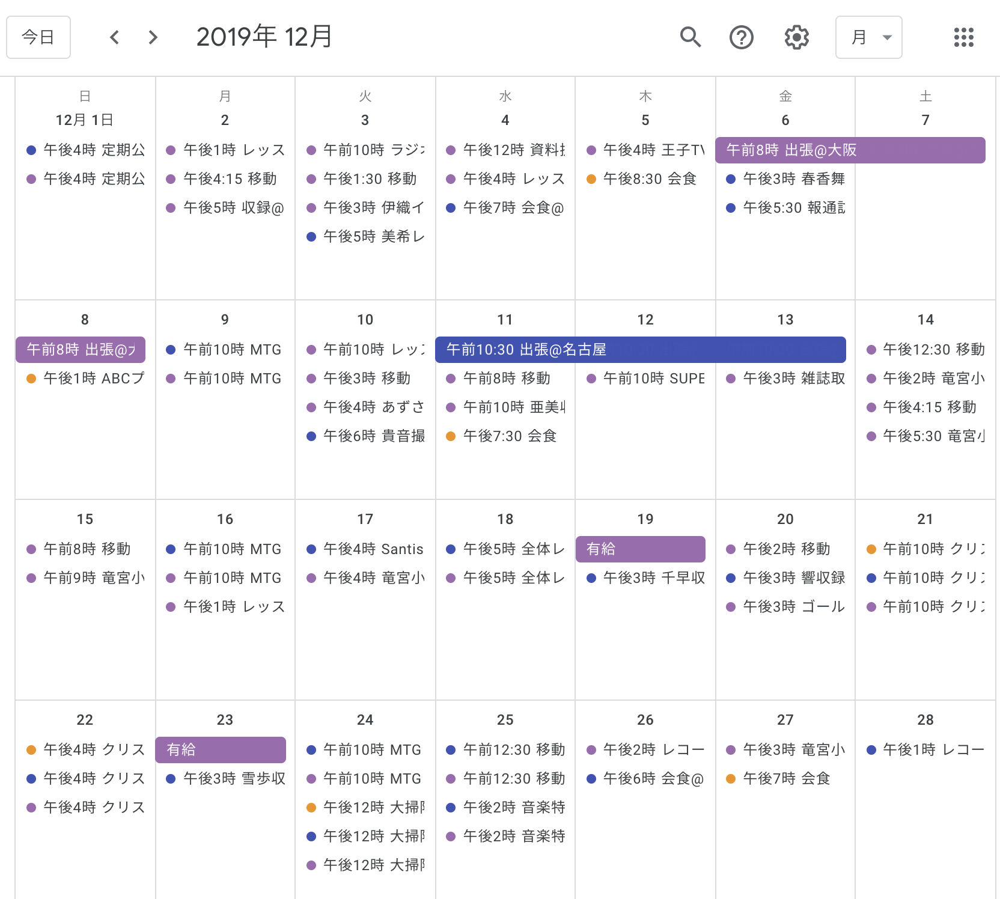
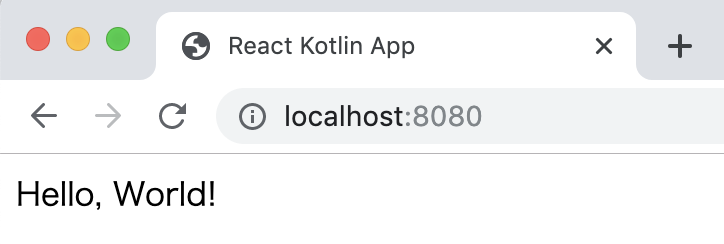
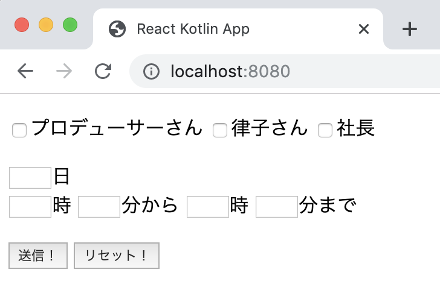
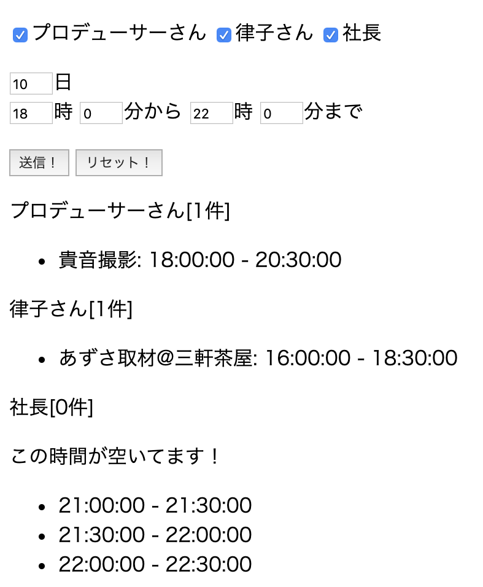

# 小鳥さんと一緒に100%Kotlinのサイト製作<br><span class="subtitle">〜Frontend編〜</span>
<p class="right">著:にしこりさぶろ〜</p>

## プロローグ -765プロの年末-

#### プロデューサー
 おはようございますー！お、律子！今日も早いな。

#### 律子
 おはようございます、プロデューサー。早いもなにも、年末年始の芸能事務所に閑古鳥が鳴いていたらそれこそ一大事ですよ。今日もこれからアポが3件と、夜はレッスンですし。

#### プロデューサー
 お疲れさま。僕の予定もぎっしりで……、そうだ！この前導入したGoogle Calendar、使い心地はどうだ？

#### 律子
 なかなか良い感じね！手帳で管理していた時は、あっという間に余白が埋まっちゃって大変でしたから。プロデューサーや社長の予定をいつでも確認できるのも、すごく良いわ！

#### プロデューサー
 おおっ、良かったー！入社してすぐ、全員分の予定を三日三晩コピペした甲斐があったよ！

#### 律子
 スケジュール管理に手帳を使わないなんて、最初は信じられなかったけど、最先端のツールはやっぱり使いこなさないとですね！それじゃ、そろそろ時間なので。

#### プロデューサー
 いってらっしゃい！外寒いから、気をつけてなー！
 ……さて、僕も仕事始めるか……？えっと……、音無、さん？

#### 小鳥
 ……は゛い゛、おはよう、ございます……。

#### プロデューサー
 机に突っ伏して、大丈夫ですか？どこか体調、悪かったりしますか？

#### 小鳥
 いえ、実は……社長から頼まれた、大人メンバーでの忘年会が……。

#### プロデューサー
 あぁ、そういえば。年末ですし、そろそろお店埋まっちゃいますね。
<br/>
<br/>


<center>図1. 予定いっぱいのGoogle Calendar</center><br/>

#### 小鳥
 そうなんです。でも、予定が、予定がみっちり詰まったこのGoogle Calendarから、全員の都合が合う日を探すのが、もう大変で大変で……。

#### プロデューサー
 なるほど……。音無さん、ほぼ毎日僕達のスケジュールチェックしてますもんね……。

#### 小鳥
 そうなんです！大変なんです！だからプロデューサーさん、これ、自動化できないですか！？できれば、PCからもスマートフォンからも確認できるWebアプリで！

#### プロデューサー
 えっ！？ま、まぁ「Google Calendarから予定を取って、空いた時間を探す」だけなら、そんなに難しくはないですけど……。でも僕も年末は、外回りや収録・取材の付き添いでまとまった時間は取れないんですよ……。

 それから小鳥さん、WebアプリだとJavaScriptの知識が必要ですよ？今から新しく言語を覚えるんじゃ、とても年末には間に合わ……

#### 小鳥
 プロデューサーさん、私、Kotlinなら書けます！！！
 前にプロデューサーさんに教えてもらってから、Kotlin Koans(\*1)もやって、Kotlin in Actions(\*2)も一通り読みました！それから、8月のKotlin Festも行ったんですけど、Kotlin/JSを使ってWebアプリを作った人のお話(\*3)聞きました！だから今の私なら、Webアプリも作れます！

#### プロデューサー
 す、すごい熱量ですね。ただ、Kotlin/JS、最初の環境構築が大変じゃないですか？

#### 小鳥
 そうなんです……。Kotlin/JS、触ってみたらなぜか「うぇぶぱっく」をたくさん書かないといけないみたいで。

<footer>\*1 https://play.kotlinlang.org/koans/overview</footer>
<footer>\*2 https://www.amazon.co.jp/dp/4839961743</footer>
<footer>\*3 https://speakerdeck.com/subroh0508/jsdezuo-tutagui-ji</footer>

#### 小鳥
 だからプロデューサーさん、無理を承知でお願いします！Kotlin/JSの環境構築、やってもらえないでしょうか！？

#### プロデューサー
 (さらっと1番大変なところをお願いしてきた……)

 うーん、そうですね……。確かにビルド環境の整備だけなら、ギリギリ時間取れるかも？その後はほとんど手助けできないと思いますが、それでも大丈夫ですか？

#### 小鳥
 ……！ありがとうございます！！！私、頑張ります！！！
  
 環境構築、できたらGitHubにpushしてもらえると嬉しいです！後で私の方でforkして、機能を作っていきますから！

#### プロデューサー
 は、はい！了解です……！

 (音無さん、もうGitHubまで使いこなせるのか……)

## §1 Kotlin/JSでDOM操作

 プロデューサーさん、早い！もうコード(\*4)が上がってます！Firebase Functions経由でGoogle Calendarから予定を取ってくるAPIまで実装済みです！時間がないと言いながら、流石です。
 
 それじゃあ早速、cloneしてローカルで動作確認してみましょう！development環境での実行コマンドを叩きます！(\*5)

```
$ yarn run build # index.htmlの生成に必要
$ yarn run dev
```

 さて、このまま`localhost:8080`にアクセスすれば……。完璧です！「Hello, World!」、ちゃんと出力されてます！

<footer>\*4 https://github.com/subroh0508/imasbook04-sample</footer>
<footer>\*5 commit hash: [d892d91b8cc7ac50e6fe4b6c477ea20903fc4bdd](https://github.com/subroh0508/imasbook04-sample/commit/d892d91b8cc7ac50e6fe4b6c477ea20903fc4bdd)</footer>


<center>図2. Kotlin/JSでHello,World!</center><br/>

 まずは`index.template.html`を編集してUIを作ります！必要なのは、
 
- プロデューサーさん、律子さん、社長のカレンダーのうち、どれを見に行くか選ぶためのチェックボックス
- 日付と、空いているか調べたい時間帯を入力するテキストボックス
- Firebase Functionsにリクエストを送る送信ボタン
- 入力値をリセットするリセットボタン


 この4つです。ささっと実装しちゃいます！今回はとにかく完成を急ぎたいので、CSSは一切使わず進めますよ。

 書けたらもう一度、`yarn run build`と`yarn run dev`を実行です。どうでしょう……。うん、良い感じですね！(\*6)

<br/>


<center>図3. 実装したUI</center><br/>

<footer>\*6 commit hash: [c735dce6d277524128cf0d4076ac61228f2b04dd](https://github.com/subroh0508/imasbook04-sample/commit/c735dce6d277524128cf0d4076ac61228f2b04dd)</footer>

 UIが用意できたところで、リセットボタンのクリック動作を実装します。Kotlin/JSでのDOM要素の取得は、JavaScriptとほぼ同じように書くことができるんですよ。

 例えば、`name`属性が`'reset'`の要素を取得したい場合は、こんな感じのコードになります。

```
val resetButton: Node? = document.getElementsByName("reset")[0]
```

 因みに、チェックボックスやテキストボックスのようなDOM要素から値を取りたい、そんな時は`HTMLInputElement`への型キャストが必要になりますよ。覚えておいてくださいね！

```
val day: HTMLInputElement? =
    document.getElementsByName("day")[0] as? HTMLInputElement?
```

 これでDOM要素が取得できました。次は、値をリセットする関数を書いていきます。

```
val producer: HTMLInputElement?
    get() = document.getElementsByName("producer")[0] as? HTMLInputElement
val ritsuko: HTMLInputElement?
    get() = document.getElementsByName("ritsuko")[0] as? HTMLInputElement
val junjirou: HTMLInputElement?
    get() = document.getElementsByName("junjirou")[0] as? HTMLInputElement
val day: HTMLInputElement?
    get() = document.getElementsByName("day")[0] as? HTMLInputElement
val minHour: HTMLInputElement?
    get() = document.getElementsByName("minHour")[0] as? HTMLInputElement
val minMinute: HTMLInputElement?
    get() = document.getElementsByName("minMinute")[0] as? HTMLInputElement
val maxHour: HTMLInputElement?
    get() = document.getElementsByName("maxHour")[0] as? HTMLInputElement
val maxMinute: HTMLInputElement?
    get() = document.getElementsByName("maxMinute")[0] as? HTMLInputElement

fun reset(
        checked: Boolean = false,
        dayValue: String = "1",
        minHourValue: String = "12",
        minMinuteValue: String = "0",
        maxHourValue: String = "13",
        maxMinuteValue: String = "0"
) {
    producer?.checked = checked
    ritsuko?.checked = checked
    junjirou?.checked = checked
    day?.value = dayValue
    minHour?.value = minHourValue
    minMinute?.value = minMinuteValue
    maxHour?.value = maxHourValue
    maxMinute?.value = maxMinuteValue
}
```

 また新しい文法がでてきました。`get() = document.get...`となっているこの書き方、**カスタムゲッター**と言います。

  `get() = ...`/`set(value) { ... }`と書くことで、Kotlinのプロパティ(=Javaで言うフィールド変数)はカスタムのゲッターとセッターを定義することができます(\*7)。カスタムゲッターを使うことで、プロパティにアクセスする度にゲッター内の処理が実行され、まるで関数のように扱うことができるんですよ！

 そして最後に、リセットボタンにクリックイベントに対するコールバックを実装(\*8)します。これもJavaScriptの時とほぼ一緒、です！

```
resetButton?.addEventListener("click", { event: Event? ->
    reset()
})
```

 それじゃあ、リセットボタンを押してみましょう。全てのチェックボックスのチェックが外れて、日付が「1」に、時間帯が「12時00分から13時00分」に変わりましたよ！これでもう、DOM操作は完璧です。順調ですね！

## §2 Firebase Functionsへのリクエスト

 シンプルですけど、UIの実装は終わりました。次はプロデューサーさんがFirebase Functionsに置いてくれたAPIから、プロデューサーさん、律子さん、社長のスケジュールを取得しましょう！

<footer>\*7 https://kotlinlang.org/docs/reference/properties.html#getters-and-setters</footer>
<footer>\*8 commit hash: [09ddbc7169e6a692324de928fcd59df2602067a2](https://github.com/subroh0508/imasbook04-sample/commit/09ddbc7169e6a692324de928fcd59df2602067a2)</footer>

 因みに、APIの仕様はこんな感じです！

- GET /schedules
- パラメーター
  - names: 予定の空きをチェックしたい人の名前
  - from: 開始時間(ISO8601形式)
  - to: 終了時間(ISO8601形式)
- レスポンス
  - Google Calendar APIの`Events.list`のレスポンスそのまま(\*9)


 HTTPのクライアントライブラリには、KtorのKotlin/JS用ライブラリ(\*10)が最も高機能ですね。ですが今回は、簡単なGETのリクエストを送るだけなので、JavaScriptのFetch API(\*11)を使って実装しちゃいます！

 Kotlin/JSでFetch APIを利用するには、`window`プロパティから生えている`fetch`メソッドを使います。返り値は`Promise`クラスのインスタンスになります。JavaScriptで扱う場合と、ほぼ一緒ですね。

```
val query: String = "..."
val promise: Promise<Any?> = window.fetch(
        "https://us-central1-imasbook04-sample.cloudfunctions.net" + 
            "/schedules?${query}",
        RequestInit(mode = RequestMode.CORS)
)
        .then { response -> response.json() }
```

 上記コードの最後の行、`Response#json`メソッドを使ってAPIレスポンスのBodyを取得しています。なんですけど、このままだとBodyの値が`Any?`型になってしまい、ちょっと扱いづらいです。

 なので、Google Calendarから取ってきたイベントを表す、`CalendarEvent`クラスを新たに定義して、Bodyの値を変換しましょう！

 Firebase Functionsからはたくさんの値が降ってきますけど、今回のアプリでは「イベントが誰のものか」「イベントの名前」「開始時間」「終了時間」の4つが分かれば十分そうです。なので、これを満たすように`data class`で`CalendarEvent`クラスを定義します。

<footer>\*9 https://developers.google.com/calendar/v3/reference/events/list#response_1</footer>
<footer>\*10 https://ktor.io/clients/http-client/multiplatform.html#Javascript</footer>
<footer>\*11 https://developer.mozilla.org/en-US/docs/Web/API/Fetch_API/Using_Fetch</footer>

```
class CalendarEvent(
        val name: String,
        val summary: String,
        val start: Date,
        val end: Date
)
``` 

 ついでに、`Any?`から`CalendarEvent`に型を変換するメソッドも、`CalendarEvent`のクラスメソッドとして実装します！

```
companion object {
    fun fromDynamic(obj: dynamic): CalendarEvent = CalendarEvent(
            name = when (obj.organizer.displayName) {
                "imasbook04_producer" -> "プロデューサーさん"
                "imasbook04_ritsuko" -> "律子さん"
                "imasbook04_junjirou" -> "社長"
                else -> "？？？"
            },
            summary = obj.summary as String,
            start = Date(Date.parse(obj.start.dateTime as String)),
            end = Date(Date.parse(obj.end.dateTime as String))
    )
}
```

 さてさて、`fromDynamic`メソッドの引数に、また見慣れない単語が出てきました。そう、`dynamic`型です。この`dynamic`、Kotlinの中でもKotlin/JSにしか登場しない、珍しい文法なんです！

 はてさて、この子はどんな働きをする型でしょう？その答えは、**「Kotlinのコードの中で、JavaScriptのオブジェクトをそのまま扱うことができる型」**です！

 ……何を言っているかわからない、ですか？了解です、例をお見せします。

```
val obj: dynamic = js("{ hoge: "hoge", aaa: { bbb: "bbb" } }")...(1)

println(obj.hoge) // => "hoge" ...(2)
println(obj.aaa.bbb) // => "bbb" ...(2)

obj.aaa.ccc = "1234"

println(obj.aaa.ccc) // => "1234"...(3)
```

 コード例の(1)では、Kotlin/JSの`js`メソッドを使って、JavaScriptのオブジェクトを`dynamic`型で宣言しています。

 `dynamic`型で宣言された変数`obj`は、Kotlinのコードの中で **「あたかもJavaScriptのオブジェクトのように」**ふるまいます。例えば(2)のように、JavaScriptとほぼ同じようなアクセサで、`hoge`キーに対応する文字列や`aaa.bbb`キーに対応する文字列を取得できます。また、(3)のように、存在しないキーに対する代入処理も、いともかんたんに書けちゃうんです。

 そうです！`dynamic`型は、Kotlinの世界とJavaScriptの世界を結ぶ、とても優秀な橋渡し役なんです！この`dynamic`型があるからこそ、JavaScriptのクラスや関数をKotlinの世界でも自由に扱うことができるんです！

 でも、1つ注意があります。この`dynamic`型、便利だからといってたくさん使うと、型安全なKotlinの良さが完全に消えてしまいます……。**アイドルの個性を活かしつつ、お仕事を取ってくるのが優秀なプロデューサー**、ですよね？だから**Kotlin/JSでも、Kotlinの良さを引き出せるよう、`dynamic`型とKotlinの型のマッピングメソッドはサボらずしっかり実装しましょう**ね！

 Firebase Functionsへのリクエストの実装はあと少し！最後は、チェックボックスやテキストボックスの値からリクエストのクエリを生成します！

```
val dayValue = day?.value ?: "1"
val minHourValue = minHour?.value ?: "0"
val minMinuteValue = minMinute?.value ?: "0"
val maxHourValue = maxHour?.value ?: "0"
val maxMinuteValue = maxMinute?.value ?: "0"

val queries: List<String> = listOf(
        "names[]=${
            listOfNotNull(producer, ritsuko, junjirou)
                .filter { it.checked }
                .joinToString("&names[]=") { it.name }
        }",
        "from=${
            dateTimeFormat(
                day = dayValue,
                hour = minHourValue,
                minute = minMinuteValue
            )
        }%2B09:00",
        "to=${
            dateTimeFormat(
                day = dayValue,
                hour = maxHourValue,
                minute = maxMinuteValue
            )
        }%2B09:00"
)

val query: String = queries.joinToString("&")
``` 

 ここまでの実装のまとめです！(\*12)

```
submitButton?.addEventListener("click", { event: Event? ->
    val dayValue = day?.value ?: "1"
    val minHourValue = minHour?.value ?: "0"
    val minMinuteValue = minMinute?.value ?: "0"
    val maxHourValue = maxHour?.value ?: "0"
    val maxMinuteValue = maxMinute?.value ?: "0"
    val queries = listOf(
            "names[]=${
                listOfNotNull(producer, ritsuko, junjirou)
                    .filter { it.checked }
                    .joinToString("&names[]=") { it.name }
            }",
            "from=${
                dateTimeFormat(
                    day = dayValue,
                    hour = minHourValue,
                    minute = minMinuteValue
                )
            }%2B09:00",
            "to=${
                dateTimeFormat(
                    day = dayValue,
                    hour = maxHourValue,
                    minute = maxMinuteValue
                )
            }%2B09:00"
    )

    request(queries.joinToString("&"))
            .then {
                document.getElementById("result")?.clear()
                document.getElementById("result")
                    ?.appendText(it.toString())
            }
})
```

<footer>\*12 commit hash: [3b701a6ae7337cfcc76827f86034427ae2df19b6](https://github.com/subroh0508/imasbook04-sample/commit/3b701a6ae7337cfcc76827f86034427ae2df19b6)</footer>

```
fun request(query: String): Promise<List<CalendarEvent>> =
        window.fetch(
                "http://localhost:5000/imasbook04-sample/us-central1" +
                    "/schedules?${query}",
                RequestInit(mode = RequestMode.CORS)
        )
                .then { response -> response.json() }
                .then { body ->
                    body.unsafeCast<Array<Array<dynamic>>>()
                        .flatten()
                        .map { CalendarEvent.fromDynamic(it) }
                }
```

## §3 空き時間を探すロジックの実装 + 結果の表示

 遂にFirebase Functionsから3人のスケジュールを取得できました！後は空き時間を探すロジックを書いて、結果をHTMLに表示するだけです！頑張りましょう！

 まず最初に、Kotlin/JSでのDOM操作がしやすくなるよう、ライブラリを追加します。`kotlinx-html`というライブラリを`yarn add`します。

```
yarn add --dev kotlinx-html
```

 このライブラリを使うと、Kotlin/JS上で簡単にHTMLを書けるようになります！試しに`kotlinx-html`を使って、Firebase Functionsから取得したスケジュールを`ul`/`li`タグでリスト表示するメソッドを実装してみましょう(\*13)。

```
fun resultElement(events: List<CalendarEvent>) = document.create.div {
    val producerEvents = events.filter { it.name == "プロデューサーさん" }
    val ritsukoEvents = events.filter { it.name == "律子さん" }
    val junjirouEvents = events.filter { it.name == "社長" }

    fun kotlinx.html.FlowContent.eventSummary(
        name: String,
        events: List<CalendarEvent>
    ) {
        // (1) divタグ
        div { +"${name}[${events.size}件]" }
        if (events.isNotEmpty()) {
            // (2) ulタグ
            ul { events.forEach {
                // (3) liタグ
                li { +"${it.summary + ":"  + 
                        it.startTimeString() + " - " + it.endTimeString()}" }
            }
        }
    }
    // (4) pタグ
    p {
        eventSummary("プロデューサーさん", producerEvents)
        eventSummary("律子さん", ritsukoEvents)
        eventSummary("社長", junjirouEvents)
    }
}
```

<footer>\*13 commit hash: [31a747b55ceaa03bddfd70a82f39216b41b936af](https://github.com/subroh0508/imasbook04-sample/commit/31a747b55ceaa03bddfd70a82f39216b41b936af)</footer>

 (1)〜(4)の箇所で`kotlinx-html`のメソッドを使っていますよ。`タグ名 { ... }`の形でHTMLを直に書いているような見た目を崩すことなく、DOMの組み立てができるよくできたライブラリです！

 残るは取得したスケジュールから、空き時間を探すロジックです。今回はシンプルに、「開始時間から終了時間まで、30分毎に空き時間があるかforループでチェックする」方法で実装してみます。

```
const val THIRTY_MIN = 1800000L

// offset時間から30分の間にスケジュールが存在するかチェックするメソッド
fun checkFreeTimes(offset: Long, events: List<CalendarEvent>): Boolean =
        events.filterNot {
            it.end.getTime().toLong() < offset ||
                (offset + THIRTY_MIN) < it.start.getTime().toLong()
        }.isEmpty()

val freeTimes: MutableList<Long> = mutableListOf()
// 入力した開始時間から終了時間まで、30分毎にチェックメソッドを実行する
// 空いているoffset時間はMutableListに格納する
for (offset in minTime..maxTime step THIRTY_MIN) {
    if (checkFreeTimes(offset, events)) {
        freeTimes.add(offset)
    }
}
```

 空き時間が取得できたら、最後は表示です。長かった作業もこれで終わります！

```
p { if (freeTimes.isNotEmpty()) {
    div { +"この時間が空いてます！" }
    ul { freeTimes.forEach { offset ->
        li { +"${
            Date(offset).toLocaleTimeString("ja-JP") + "-" +
                Date(offset + THIRTY_MIN).toLocaleTimeString("ja-JP")
        }}
    } }
} else { div { +"空いている時間が見つかりませんでした(´・ω・｀)" } } }
``` 

 そして運命の時……。値を入力して、空き時間を実際に調べてみましょう……！どきどき……。


<center>図4. 完成したスケジュールチェッカー</center><br/>
 
 やりました！完成です！(\*14)
 
 ……あっ、でもよく見ると、後ろの30分余計に空き時間が表示されちゃってます。ここはあとでPull Requestを出して、修正しておきましょう(\*15)。何よりこれで、スケジュール調整が一気に楽になります！早くプロデューサーさんにも報告しないと！

<footer>\*14 commit hash: [d094f6b20bafdb2a497b18763abf140ace2afc9c](https://github.com/subroh0508/imasbook04-sample/commit/d094f6b20bafdb2a497b18763abf140ace2afc9c)</footer>
<footer>\*15 https://github.com/subroh0508/imasbook04-sample/pull/2</footer>

## エピローグ -新年明けまして-

#### プロデューサー
 ただいま戻りましたー！お疲れさまです、音無さん！

 去年の年末に作ったスケジュールチェッカー、その後の調子はどうですか？

#### 小鳥
 もう最高です！！！Google Calendarを開く度に憂鬱だったあの時がウソのようです！！！

 せっかくなので、今度はあのスケジュールチェッカーから、直接予定の追加もできるようにしたいです！

#### プロデューサー
 いやー、今の音無さんだったらちょちょいのちょいですよ！Kotlin、完璧に使いこなしているじゃないですか！

#### 小鳥
 そんなことはないです。年末は最初の環境構築をプロデューサーさんに丸ごと頼ってしまいましたし……。まだまだ、精進あるのみです！

(ガチャン！)

#### 律子
 た、大変です！プロデューサー！

#### プロデューサー
 お、お疲れ律子！どうした？そんなに血相を変えて？

#### 律子
 今日の16時から入れていたゴールドレコードのアポ、たった今「765プロさんの方から取りやめの電話があった」と連絡があったんです。それでまさかとは思って、他の取材や収録の予定も確認を取ってみたんですけど、軒並み全部キャンセルされていて……。

#### プロデューサー
 な、なんだって！！！年始の大事なかきいれ時に……。

#### 律子
 犯人はおそらく、黒井社長でしょうね……。できる限りのリカバーはしますが、ここまでやられると、完全に元に戻すのは不可能かと。

#### プロデューサー
 でもどうやって？黒井社長の嫌がらせ対策で、最近アポや取材の予定はあらゆる手段を使って表に出ないようにしていたのに。一体どこから流出したんだ？

#### 律子
 ……そういえば、去年小鳥さんが作ったスケジュールチェッカー、少し触ってみましたけど、一切ログインやユーザー確認の画面、出てこなかったですよね？あれ、何のアクセス制限もなしに公開したり、してないですよね？

#### プロデューサー & 小鳥
 ……あ。

#### プロデューサー & 小鳥
 ああああああああああああああ！！！！！！！！！！！！


